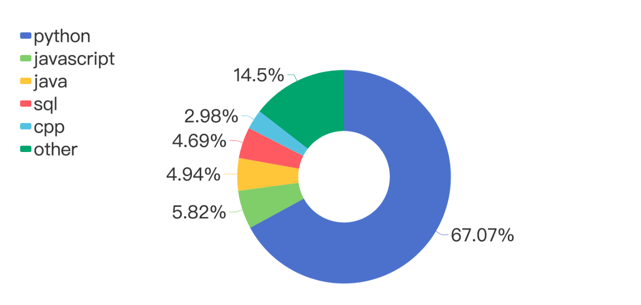
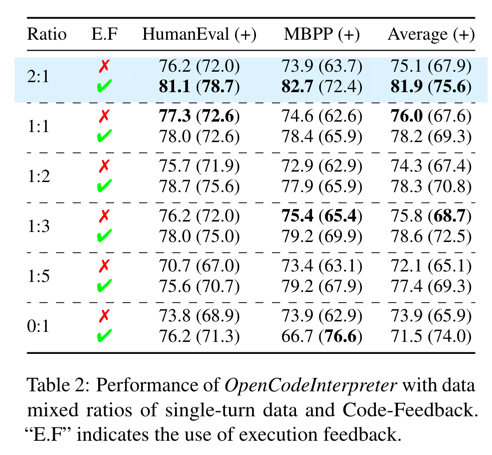

# 如何构建一个高质量的数据集？

这个目录下主要是想从**代码生成**的角度来看，怎么通过现有的一些代码指令微调数据集，通过过滤、精练等方式构造出一个高质量的数据集。

参考资料：
- arXiv论文：https://arxiv.org/abs/2402.14658
- CodeFeedback对话数据集（共66K）：https://huggingface.co/datasets/m-a-p/Code-Feedback
- CodeFeedback指令数据集（共156K）：https://huggingface.co/datasets/m-a-p/CodeFeedback-Filtered-Instruction

Code-Feedback 数据格式：
```json
{
    "id": 1,
    "messages": [
        {
            "role": "user",
            "content": "Write a Ruby code to convert a double-linked list to a single-linked list without using any built-in methods or data structures."
        },
        {
            "role": "assistant",
            "content": "Here is a Ruby code that converts a double-linked list to a single-linked list without using any built-in methods or data structures:\n\n```ruby\nclass Node\n  attr_accessor :value, :next_node, :prev_node\n\n  def initialize(value, next_node = nil, prev_node = nil)\n    @value = value\n    @next_node = next_node\n    @prev_node = prev_node\n  end\nend\n\ndef convert_to_single_linked_list(head)\n  current_node = head\n  while current_node.next_node != nil\n    current_node.next_node.prev_node = nil\n    current_node = current_node.next_node\n  end\n  current_node\nend\n\n# Create a double-linked list\nnode1 = Node.new(1)\nnode2 = Node.new(2)\nnode3 = Node.new(3)\n\nnode1.next_node = node2\nnode2.prev_node = node1\nnode2.next_node = node3\nnode3.prev_node = node2\n\n# Convert to single-linked list\nsingle_linked_list_head = convert_to_single_linked_list(node1)\n\n# Print single-linked list\ncurrent_node = single_linked_list_head\nwhile current_node != nil\n  puts current_node.value\n  current_node = current_node.next_node\nend\n```\n\nThis code defines a `Node` class representing each node in the double-linked list. The `convert_to_single_linked_list` method takes the head of the double-linked list as input and iterates through the list, removing the previous node references. It returns the new head of the single-linked list.\n\nIn this example, a double-linked list with nodes `1 -> 2 -> 3` is created. After conversion, the single-linked list will have nodes `1 -> 2 -> 3`, and it is printed using a loop that iterates through each node in the single-linked list."
        },
        {
            "role": "user",
            "content": "Write a code snippet using Python to pop an element from a list, but without using the built-in `pop()` function, slicing, or any additional data structures."
        },
        {
            "role": "assistant",
            "content": "Here's a code snippet that removes an element from a list without using the built-in `pop()`, slicing, or any additional data structures:\n\n```python\ndef pop_element(lst, index):\n    if index < 0 or index >= len(lst):\n        raise IndexError(\"Index out of range\")\n    \n    element = lst[index]\n    \n    for i in range(index, len(lst)-1):\n        lst[i] = lst[i+1]\n    \n    lst.pop()\n    \n    return element\n```\n\nHere's how you can use this function:\n\n```python\nmy_list = [1, 2, 3, 4, 5]\nindex = 2\n\nremoved_element = pop_element(my_list, index)\n\nprint(\"Removed element:\", removed_element)\nprint(\"Updated list:\", my_list)\n```\n\nOutput:\n```\nRemoved element: 3\nUpdated list: [1, 2, 4, 5]\n```\n\nNote that this function modifies the original list and returns the removed element. If the index is out of range, it raises an `IndexError` exception."
        }
    ]
}
```

CodeFeedback-Filtered-Instruction 数据格式：
```json
{
    "query": "You need to convert the following statement in SQL to equivalent PostgreSQL syntax and return only the rows where the Name starts with 'J', has a length greater than 4, and the Age is greater than or equal to 18.",
    "answer": "To convert the statement in SQL to equivalent PostgreSQL syntax, you can use the following query:\n\n```sql\nSELECT *\nFROM your_table\nWHERE Name LIKE 'J%' AND length(Name) > 4 AND Age >= 18;\n```\n\nMake sure to replace \"your_table\" with the actual name of the table you are querying. This query will return only the rows where the Name starts with 'J', has a length greater than 4, and the Age is greater than or equal to 18.",
    "resource": "evolinstruct",
    "lang": "sql"
}
```
resource: 
- evolinstruct
- magicoder
- wizardcoder
- sharegpt

构建过程将follow CodeFeedback数据集的构建过程，如下图（图片来源于论文），遵循其满足的特定标准：
1) 多样且具有挑战性的现实世界查询：数据集应包含来自现实世界编码任务的广泛查询，既具有多样性又具有复杂性。
2) 多回合对话结构：Code-Feedback结构为多回合对话，包含两种类型的反馈：执行反馈，包括来自编译器的输出和诊断信息；以及人类反馈，包括用户提供的额外指导或指令。
3) 交替的文本和代码响应：每个响应应当提供自然语言解释与代码片段相结合的回答，以提供解决编码查询的整体方法。

查询来源主要分为两类：各种开源数据集和来自LeetCode的编码挑战。


### 开源数据集
聚合下面这四个开源指令微调数据集，从中得到共287k数据。
- Magicoder-OSS-Instruct: https://huggingface.co/datasets/ise-uiuc/Magicoder-OSS-Instruct-75K
- Python code subset of ShareGPT: https://huggingface.co/datasets/ajibawa-2023/Python-Code-23k-ShareGPT
- Magicoder-Evol-Instruct: https://huggingface.co/datasets/ise-uiuc/Magicoder-Evol-Instruct-110K
- Evol-Instruct-Code: https://huggingface.co/datasets/nickrosh/Evol-Instruct-Code-80k-v1

这四个数据集的样例如下：
Magicoder-OSS-Instruct:
```json
{
    "lang": "cpp",
    "raw_index": 101533,
    "index": 4626,
    "seed": "  int n;\n  cin >> n;\n  vector<int> a(n + 1), b(n + 1);\n  for (int i = 1; i <= n; ++i) cin >> a[i] >> b[i];\n  auto c = convolution(a, b);\n  for (int i = 1; i <= 2 * n; ++i) cout << c[i] << endl;\n}\n",
    "openai_fingerprint": "fp_eeff13170a",
    "problem": "You are given two arrays, A and B, each of length n. You need to perform a convolution operation on these arrays and output the resulting array.\n\nThe convolution of two arrays A and B is defined as follows:\n- Let C be the resulting array of length 2n-1, where C[i] = Σ(A[j] * B[i-j]) for j = max(0, i-n+1) to min(i, n-1).\n\nWrite a function or method to perform the convolution operation and return the resulting array C.\n\nFunction Signature: \n```cpp\nvector<int> convolution(vector<int> a, vector<int> b)\n```\n\nInput:\n- Two arrays a and b of length n (1 <= n <= 10^5), where each element of the array is an integer (-10^9 <= a[i], b[i] <= 10^9).\n\nOutput:\n- Return the resulting array C after performing the convolution operation.\n\nExample:\nInput:\na = [1, 2, 3]\nb = [4, 5, 6]\n\nOutput:\nconvolution(a, b) -> [4, 13, 28, 27, 18]",
    "solution": "```cpp\n#include <iostream>\n#include <vector>\nusing namespace std;\n\nvector<int> convolution(vector<int> a, vector<int> b) {\n    int n = a.size();\n    vector<int> c(2 * n - 1, 0);\n    for (int i = 0; i < 2 * n - 1; ++i) {\n        for (int j = max(0, i - n + 1); j <= min(i, n - 1); ++j) {\n            c[i] += a[j] * b[i - j];\n        }\n    }\n    return c;\n}\n\nint main() {\n    vector<int> a = {1, 2, 3};\n    vector<int> b = {4, 5, 6};\n    vector<int> result = convolution(a, b);\n    for (int i = 0; i < result.size(); ++i) {\n        cout << result[i] << \" \";\n    }\n    return 0;\n}\n```"
}
```
Python code subset of ShareGPT: 
```json
{
    "id": "0",
    "conversations": [
        {
            "from": "human",
            "value": "Create a nested loop to print every combination of numbers between 0-9, excluding any combination that contains the number 5. Additionally, exclude any combination that contains a repeating digit. Implement the solution without using any built-in functions or libraries to check for repeating digits."
        },
        {
            "from": "gpt",
            "value": "Here is an example of a nested loop in Python to print every combination of numbers between 0-9, excluding any combination that contains the number 5 or repeating digits:\n\n```python\nfor i in range(10):  # First digit\n    for j in range(10):  # Second digit\n        for k in range(10):  # Third digit\n            # Checking for the conditions\n            if i != 5 and j != 5 and k != 5 and i != j and i != k and j != k:\n                print(i, j, k)\n```\n\nThis code will generate and print every combination of three digits between 0-9 that do not contain the number 5 and do not have any repeating digits."
        }
    ]
}
```
Magicoder-Evol-Instruct: 
```json
{
    "instruction": "Please amend the subsequent Python script so that it includes a 'while' loop rather than the existing 'for' loop, which iterates through the items of an integer list.\n\nThe script currently has a bug where it attempts to print an object that is outside the bounds of the list. Fix this error and modify the script to use 'while' instead of 'for' loop. Ensure your script correctly handles empty lists. \n\n```python\n  # Establish an integer list\n  arr = [1, 2, 3, 4]\n\n  # Determine the length of the list\n  n = len(arr)\n\n  # Traverse the list and output each individual element\n  for i in range(n+1):\n      print(arr[i])\n```",
    "response": "```python\n# Establish an integer list\narr = [1, 2, 3, 4]\n\n# Determine the length of the list\nn = len(arr)\n\n# Initialize index at 0\ni = 0\n\n# Traverse the list and output each individual element\nwhile i < n:\n    print(arr[i])\n    i += 1\n```\nIn the given code, it tries to access `arr[n]` which is out of bounds as python list indexing starts from 0 and ends at n-1 for a list of length n.\nAlso, I used `while` loop as per your request. By initializing `i=0` before the loop and `i += 1` within the loop, we can iterate over the list. This iteration continues until `i` is less than `n`, the length of the list. The `while` loop will not proceed if the list is empty so it correctly handles empty lists."
}
```
Evol-Instruct-Code:
```json
{
    "instruction": "Create a nested loop to print every combination of numbers between 0-9, excluding any combination that contains the number 5. Additionally, exclude any combination that contains a repeating digit. Implement the solution without using any built-in functions or libraries to check for repeating digits.",
    "output": "Here is an example of a nested loop in Python to print every combination of numbers between 0-9, excluding any combination that contains the number 5 or repeating digits:\n\n```python\nfor i in range(10):  # First digit\n    for j in range(10):  # Second digit\n        for k in range(10):  # Third digit\n            # Checking for the conditions\n            if i != 5 and j != 5 and k != 5 and i != j and i != k and j != k:\n                print(i, j, k)\n```\n\nThis code will generate and print every combination of three digits between 0-9 that do not contain the number 5 and do not have any repeating digits."
}
```

合并成如下格式：
```json
{
    "query": "You need to convert the following statement in SQL to equivalent PostgreSQL syntax and return only the rows where the Name starts with 'J', has a length greater than 4, and the Age is greater than or equal to 18.",
    "answer": "To convert the statement in SQL to equivalent PostgreSQL syntax, you can use the following query:\n\n```sql\nSELECT *\nFROM your_table\nWHERE Name LIKE 'J%' AND length(Name) > 4 AND Age >= 18;\n```\n\nMake sure to replace \"your_table\" with the actual name of the table you are querying. This query will return only the rows where the Name starts with 'J', has a length greater than 4, and the Age is greater than or equal to 18.",
    "resource": "evolinstruct",
    "lang": "sql"
}
```

为了提炼这个庞大的集合并分离出最复杂和信息丰富的指令，我们使用`Qwen-72B-Chat`进行选择性过滤过程。这涉及到LLM评估每个代码查询及其在编译数据集中对应的响应，并根据复杂性从1到5进行评分。只有被评为4或5的最具有挑战性的查询才被保留在我们的种子集中，确保专注于最困难的指令。

为了确保我们选择的稳健性，这个过滤操作用两个不同的提示重复进行（具体提示如下Query Filtering Prompt 1/2），从而巩固了我们最终查询选择的复杂性。这个细致的过程产生了156k个高质量的单轮代码指令，作为具有挑战性的查询池。

Query Filtering Prompt 1
```markdown
Rate the following code queries on a scale of 1 to 5 based on their complexity, where 1 is the easiest and 5 is the most difficult. Consider the complexity of the query.

Query: [{query}]
You are obliged to choose only from the following list.
Scoring Criteria:
1 Point - Very Basic: The query involves simple operations or common issues
2 Points - Basic: The query involves fundamental programming concepts or commonly used functions
3 Points - Intermediate: The query requires some programming experience, possibly involving multiple steps
4 Points - Difficult: The query involves advanced programming skills, including complex logic, algorithms, or data structures
5 Points - Very Difficult: The query requires extensive expertise, potentially involving innovative problem-solving approaches or unique algorithm design

Please give the score first then explain why
```

Query Filtering Prompt 1
```markdown
Rate the following code queries on a scale of 1 to 5 based on their complexity, where 1 is the easiest and 5 is the most difficult. Consider the complexity of the query 

Query: [{query}] 
You are obliged to choose only from the following list. 
Scoring Criteria: 
1 Point - Moderately Difficult: Involves understanding specific programming concepts or libraries, and may include medium complexity algorithms or data structures like basic sorting algorithms or tree structures. 
2 Points - Challenging: Requires handling more complex logic or algorithms such as advanced sorting algorithms, recursive logic, or intermediate data structures like hash tables and heaps. 
3 Points - Highly Challenging: Demands deeper knowledge in algorithms and data structures, potentially including graph algorithms, dynamic programming, or complex string manipulation techniques. 
4 Points - Advanced: Focuses on proficiency in programming and algorithm design, dealing with complex system architecture issues, performance optimization, or solving advanced algorithmic challenges like NP-hard problems. 
5 Points - Expert Level: The highest difficulty level, requiring innovative problem-solving approaches or unique algorithm design, possibly involving interdisciplinary knowledge or the application of cutting-edge technologies. 

Please give the score first then explain why
```

以下是对初始种子数据集应用的数据过滤过程的概述，下图总结了每个过滤阶段后的数据量。


下图是过滤后的数据集中编程语言的分步。



下面是三种被用来将这些经过筛选的单轮数据转换成含有执行和人类反馈的多轮对话的方法：

1. **Singe-turn Packing** 

直接创建多轮数据的方法是将单轮查询-响应对组合成多轮格式。受到上下文预训练技术的启发，该技术通过**整合相似的序列**来促进模型学习相关文档之间的依赖关系，我们将相似的单轮查询-响应对合并形成多轮对话。

利用BERT基础嵌入，我们将查询转换为向量化表示。对于每个查询，使用k-最近邻算法来识别其四个最接近的对应项。然后，我们从中随机选择两个或三个来组装多轮序列。为了保持数据的唯一性，一旦一个查询被选为邻居，它就不再作为未来选择的邻近查询，确保整个数据集中没有单一指令被重复。如果一个查询的潜在邻居已经被使用过，那么这个查询将被绕过。这种方法产生了16.6K个多轮实例，这些实例来源于105K个单轮实例。

2. **Interaction Simulation**

收集真实的人际交互数据面临重大挑战。为了复制一个现实的场景，我们使用`GPT-3.5`和`GPT-4`开发了一个**模拟器**。

对于每个选定的查询，`GPT-3.5`首先生成一个初步响应，我们从中提取代码片段并执行它。这次执行的结果，以及任何编译器诊断信息，然后输入到`GPT-4`中以引发后续响应。这个周期一直重复，直到`GPT-4`提供了它认为正确的解决方案，或者直到达到最多三次迭代为止。

随后，我们引入模拟的人类反馈到交互中。我们预定义了十个常见的反馈类别，包括与语法和格式、效率、功能、清晰度、错误、安全性、兼容性、资源使用、可扩展性和最佳实践相关的事项，每个类别的详细说明在这里[点击这里](#Simulating_Interactions)。

然后，`GPT-4`被提示选择最相关的反馈类别，并在该反馈类别内生成适当的响应。通过将这种模拟反馈纳入对话历史，`GPT-4`被鼓励进一步细化其解决方案，模仿复杂的用户-模型交流，并在对人类输入的响应中展示自我修正。通过这种模拟方法，我们构建了51K个示例，有效地捕捉了用户交互和反馈驱动的解决方案细化的微妙动态。

3. **Code Correction**

为了增强模型的错误处理能力，我们在数据编译中包括了一个专门的阶段，生成了500个特定的错误校正交互。

我们首先提示`GPT-4`故意生成错误的代码片段，生成错误代码片段的提示[点这里](#Code_Correction)。然后，模型使用执行这些片段时的错误消息作为校正的线索。这种方法反映了现实生活中的编码周期，开发者不断调试和完善他们的代码，从而为我们的数据集丰富了各种错误校正的例子。

在此之后，我们用那些鼓励生成正确代码输出的提示替换了最初导致错误代码的提示。这种方法确保了模型从成功的代码生成以及错误识别和校正中学习，显著提高了其解决问题的能力和对调试过程的理解。


### LeetCode的编码挑战

1. **LeetCode Similar Problem**。

借鉴程序员通过LeetCode挑战来磨练技能的做法，我们从TACO数据集中收集了类似的LeetCode问题及其解决方案。LeetCode通过标签对相关问题进行分类，便于提取相关问题。TACO确保LeetCode数据集被清洗，以防止对其他任务数据集（如HumanEval和MBPP）产生任何意外影响。通过合并相关的LeetCode问题，我们编译了303个多轮实例，用多样化的编码挑战丰富了数据集。

2. **LeetCode Follow-up Question**

我们进一步深入LeetCode数据集，分离出相同问题的不同解决方案，这些解决方案在时间或空间复杂性上有所不同，或者使用不同的编程语言实现。这种聚合同一LeetCode问题的不同解决方案的过程产生了200个多轮实例，展示了替代的问题解决方法。鉴于原始的LeetCode解决方案通常缺乏全面的自然语言解释，我们让GPT-4介入，为这些解决方案增加集成的文本解释和代码片段，将所有实例标准化为一致的格式。用于指导GPT-4进行这种丰富过程的具体提示[在这里](#LeetCode_Follow-up_Question)，确保了响应的清晰度和教育价值。


### 实验设置
这里是这篇论文中用于训练 OpenCodeInterpreter 的一些实验设置，整理在下面留作备用。

Base Model: CodeLlama and DeepSeekCoder from 7B to 70B

所有模型保持相同的超参数如下：

```shell
epoch=3
learning_rate=2e-5
warm_up_ratio=0.05
cosine scheduler
max_input_size=4096
```

为了优化微调过程，我们有策略地将WizardCoder 110k数据集中的高质量单轮数据与我们的CodeFeedback以2:1的比例结合起来。与高质量的单轮数据混合可能会进一步增强编码能力。

为什么使用2:1可以从下表看出。




### 评测设置

我们的评估框架主要利用`HumanEval`和`MBPP`，这两个基准测试因其对代码生成能力的严格测试而闻名。认识到它们原始测试套件在覆盖所有边缘情况方面的局限性，我们进一步整合了它们的扩展版本，`HumanEval+`和`MBPP+`，使用`EvalPlus`框架进行更全面的评估。

根据最近研究中概述的最佳实践，`OpenCodeInterpreter`的解决方案是通过**贪婪解码**生成的。在涉及`GPT3.5 Turbo`和`GPT-4 Turbo`的比较中，我们保持温度设置为0。`EvalPlus`的统一消毒工具对这些解决方案进行后处理，然后使用`EvalPlus`的工具集在四个基准测试中进行评估。

对于单轮代码生成，我们制定了一个简单的指令来概括原始提示，形成模型的新输入。确切的提示[在这里](#Model_Evaluation_Prompts)有详细说明，我们根据`EvalPlus`的指导方针使用`pass@1`指标评估模型的性能。

我们的分析扩展到**多轮**通过率，以探索`OpenCodeInterpreter`通过迭代反馈改进代码的熟练程度。评估的这一方面依赖于由`GPT4`生成的执行结果和合成人类反馈，以模拟现实世界的编码场景和交互。具体来说，多轮评估包括三种情景，提供了`OpenCodeInterpreter`在动态代码细化方面能力的全面视图：

1. 执行反馈：在这里，`OpenCodeInterpreter`独立利用执行结果和编译器诊断来定位和纠正错误，模仿开发人员基于直接执行反馈细化代码的过程。
2. 合成人类反馈：在这种情况下，`GPT-4`生成的反馈模仿人类输入，考虑任务描述、初始模型响应和任何执行反馈。这测试了`OpenCodeInterpreter`适应微妙的、类似人类的反馈的能力，反映了现实世界开发人员或用户交互。
3. 合成人类反馈（预言）：在前一情景的基础上，`GPT-4`还可以访问真实解决方案，提供了在精确反馈指导下`OpenCodeInterpreter`在代码细化中最佳性能的见解。

对于每个任务，代码生成和评估过程*要么在模型的解决方案成功通过评估时结束，要么在达到设定的最多两轮时结束*。如果代码样本未能通过评估，解决方案和测试结果都会被重新整合到提示中以进行细化。评估确定了三种主要的未通过结果情景：
1）异常处理：捕获并传达执行期间遇到的任何异常或错误作为错误消息，为纠正提供直接反馈。
2）非预期：在输出偏离预期结果的情况下，模型收到的反馈包括测试输入、预期输出和实际输出，突出了差异。
3）超时处理：实施超时阈值，以防止解决方案具有过长或无限运行时间导致的评估延迟。超过此阈值会触发"执行超时"通知。


### 消融实验

这一节系统地探讨了不同数据源对`OpenCodeInterpreter`性能的影响。我们进行了一系列的消融研究，以评估高质量单轮数据和多样化多轮反馈机制对模型代码生成、调试和细化能力的影响。

**高质量单轮数据的影响**。为了评估高质量单轮数据对`OpenCodeInterpreter`效果的影响，我们将以语法准确性和逻辑一致性著称的`WizardCoder 110K3`数据集纳入我们广泛的多轮数据集中。这种整合旨在找出精确的单轮代码生成和多轮交互所支持的高级迭代细化之间的最佳组合。我们的实验采用了软目标微调策略，在六种配置中进行，这些配置变化了`WizardCoder 110K`数据在我们多轮数据集中的比例。这些配置从完全纳入到完全排除`WizardCoder`数据集，评估了两个版本的模型性能：`DeepSeekCoder-Base-6.7B`和`DeepSeekCoder-Base-33B`。

上方表格中的数据显示，纳入高质量单轮数据（例如，`WizardCoder`数据集）显著提高了我们模型的多轮性能。这种战略性的纳入确保了模型从单轮任务中固有的语法准确性和逻辑一致性中受益，从而丰富了其在后续轮次中进行微妙迭代细化的能力。它揭示了高质量单轮输入在为更有效的多轮代码生成和细化奠定基础中的关键作用。

**多样化多轮数据源的好处**。在完全整合`WizardCoder`数据集后建立的增强基线的基础上，这个子节调查了不同数据源对模型细化和调试效果的优势。我们在我们的训练方案中增加了多样化的数据源，包括单轮打包、交互模拟和代码校正数据，单独和组合使用。

这些多轮数据源的使用，包括单轮打包、交互模拟和代码校正数据，单独和组合使用，明显增强了`OpenCodeInterpreter`的调试和细化功能。值得注意的是，包括代码校正数据显著提高了模型纠正错误的效率。这强调了多样化和有针对性的训练方法对提升复杂代码生成模型能力的深远影响。这种方法使这些模型能够更有效地解决复杂的编码挑战，纠正错误，并通过广泛的反馈机制细化输出。


### 附录

Simulating Interactions for Data Collection
下面分别是用于多轮执行反馈和多轮人类反馈的提示。

<!-- Simulating_Interactions -->

1. 多轮执行反馈的提示

```markdown
You are an AI code interpreter. 
Your goal is to help users do a variety of jobs by executing Python code. 
You should: 
1. Comprehend the user’s requirements carefully & to the letter. 
2. Give a brief description for what you plan to do & call the provided function to run code. 
3. Provide results analysis based on the execution output. 
4. If error occurred, try to fix it. 
5. Response in the same language as the user.
```
2. 多轮人类反馈的提示
```markdown
You are a user who gives feedback to the latest generated code. If no available code is found in the conversation, you should give a feedback to encourage assistant to generate code. 
NOTE: your feedback should be WITHIN 2 SHORT SENTENCES. 

You can refer to the following types of feedback: 
1. **Syntax and Formatting**: Checking for syntax errors, inconsistent formatting, and suggesting adherence to standard coding styles for readability and maintainability. 
2. **Efficiency**: Identifying parts of the code that can be optimized for better performance, such as reducing time complexity, optimizing loops, or suggesting more efficient data structures. 
3. **Functionality Enhancements**: Suggesting additional features or enhancements that could make the code more functional or user-friendly. 
4. **Code Clarity and Documentation**: Recommending improvements in code comments and documentation to make the code more understandable and easier to maintain. 
5. **Bug Identification**: Pointing out any potential bugs or logical errors in the code and suggesting ways to fix them. 
6. **Security Improvements**: Highlighting any security vulnerabilities in the code and suggesting best practices to enhance security. 
7. **Compatibility and Testing**: Advising on making the code more compatible with different environments or platforms and suggesting more comprehensive testing scenarios. 
8. **Resource Optimization**: Identifying areas where the code might be using more resources than necessary (like memory or CPU) and suggesting optimizations. 
9. **Scalability**: Providing insights on how the code can be made more scalable to handle larger data sets or more users. 
10. **Adherence to Best Practices**: Ensuring the code follows the best practices specific to the language or framework being used. 
    
Your output MUST be in a json format like this: 
{ 
    "satisfied": "The points that have been achieved in generated code", 
    "not_satisfied": "The points that have not yet been achieved in generated code", 
    "feedback": "The actual feedback. Your feedback should be WITHIN 2 SHORT SENTENCES. Feedback must come from a point included in ’not_satisfied’ field. You can ask the assistant here to generate code if no available code is found in previous conversations." 
}
```

<!-- Code_Correction -->

下面是指导GPT4生成错误代码的提示：
```markdown
You are an AI code interpreter. 
Your goal is to generate and execute Python code. 

Your code MUST contain at least one of the following types of errors: 
1. Syntax Error: This type of error occurs when the code violates the grammar rules of the programming language. For example, forgetting to close a parenthesis or a quotation mark, or misspelling a keyword. 
2. Logical Error: These errors sneak into your code when there’s a misunderstanding of the problem you’re solving, leading to incorrect results despite the code running without crashing. For example, calculating the average of a list of numbers by summing them up but forgetting to divide by the count of the numbers. 
3. Type Error: This error occurs when an operation is applied to an object of an inappropriate type. For example, attempting to concatenate a string with an integer without converting the integer to a string first. 
4. Name Error: This happens when the code attempts to reference a variable or a function name that hasn’t been defined. For example, trying to print a variable that hasn’t been declared. 
5. Timeout Error: This error occurs when your code gets stuck in a loop that never ends, either due to a logic flaw or a condition that never becomes false. In programming, such an error can cause your application to hang indefinitely, consuming resources and potentially leading to a crash if not handled properly. For example, writing a loop that waits for a certain condition to change, but the condition is never updated within the loop. 
   
NOTE: 
1. You MUST make mistakes in the generated code! 
2. Do not explain the errors within. Just write your thoughts and code as normal. 
3. Do not tell me you are writing the wrong code in any form (e.g., in text/code/comments). Just pretend you are writing the correct code and still not recognizing the errors.

```

<!-- LeetCode_Follow-up_Question -->

下面是指导GPT4为代码生成注释的提示：
```markdown
Here is a list containing a series of dialogues between a user and a programmer assistant. 
Following the previous dialogues, the user posed a latest problem. 
The assistant has now crafted the correct code based on the previous dialogues and the latest problem. 
Assuming you are this programmer assistant, please add some text before the code. 
The purpose of this text is to respond to the latest problem and to introduce the code that follows. 
This text may include: language used in the code, algorithm used in the code, step-by-step implementation overview, and other relevant content. 
You may use phrases like "The following code", "My code", "My solution", to refer to the @@Code. 
Your response should ONLY contain the text that you add before the code. 
Your only task is to write the text, never modify the code or remind me something. 
Never restate the previous dialogues and the problem. 

@@Previous Dialogues 
{previous dialogues} 

@@Recent Problem: 
{recent problem} 

Add the text there. 
@@Code: 
{code}
```

<!-- Model_Evaluation_Prompts -->
Model Evaluation Prompts

对于不同的基准测试，在解决方案生成的初始轮次中使用了不同的提示：HUMANEVAL和HUMANEVAL+使用了相同的提示，而MBPP和MBPP+共享了一个类似的提示。以下是这些提示的说明。

Prompt for HumanEval and HumanEval+
```markdown
You are an exceptionally intelligent coding assistant that consistently delivers accurate and reliable responses to user instructions. 

@@ Instruction 
Here is the given code to do completion: 
“‘{language} 
{original prompt} 
“‘ 
Please continue to complete the function with {language} programming language. You are not allowed to modify the given code and do the completion only. 

Please return all completed codes in one code block. 
This code block should be in the following format: 
“‘{language} 
# Your codes here 
“‘ 

@@ Response
```

Prompt for MBPP and MBPP+
```markdown
You are an exceptionally intelligent coding assistant that consistently delivers accurate and reliable responses to user instructions. 

@@ Instruction 
Here is the given problem and test examples: 
{original prompt} 

Please use the {language} programming language to solve this problem. 
Please make sure that your code includes the functions from the test samples and that the input and output formats of these functions match the test samples. 

Please return all completed codes in one code block. T
his code block should be in the following format:
“‘{language} 
# Your codes here 
“‘ 

@@ Response
```

我们使用GPT模型来模拟人类在生成反馈时的行为。提供给GPT模型的提示如下所示。

Prompt for GPT models mimicking human feedback with canonical solution
```markdown
You are tasked with providing guidance to a programmer who has drafted a code for a programming problem. 
Your role is to mimic(模仿) human-like responses and offer suggestions for modifying the code based on the canonical solution and the observed execution results. 
You should NOT directly revealing contents of the @@Canonical Solution or mentioning terms such as "canonical solution." 
You should refrain from directly writing code. 
Begin by thoroughly examining the existing code and its functionality. 
Compare the @@Existing Code with the @@Canonical Solution provided. Note any discrepancies in logic, approach, or implementation. 
Analyze the @@Execution Result obtained from running the @@Existing Code. Identify any errors, unexpected behavior, or deviations from the expected output. 
Consider potential edge cases, optimization opportunities, or alternative approaches based on insights from both the @@Canonical Solution and @@Execution Result. 
Offer guidance in a clear and understandable manner, explaining the rationale behind each suggestion. 
Refrain from providing actual code solutions, but instead focus on conceptual modifications or strategies. 
Provide constructive feedback to help the programmer improve their coding skills. 
Remember, your role is to simulate human-like guidance and expertise in programming without directly implementing solutions. 
Please respond in no more than three sentences. 

@@Problem 
{original prompt} 

@@Existing Code 
{sanitized code} 

@@Execution Result 
{execution result} 

@@Canonical Solution 
{canonical solution} 

@@Guidance
```


Prompt for GPT models mimicking human feedback without canonical solution
```markdown
You are tasked with providing guidance to a programmer who has drafted a code for a programming problem. 

Your role is to mimic human-like responses and offer suggestions for modifying the code based on the observed execution results. 
You should refrain from directly writing code. 
Begin by thoroughly examining the existing code and its functionality. 
Analyze the @@Execution Result obtained from running the @@Existing Code. Identify any errors, unexpected behavior, or deviations from the expected output. 
Consider potential edge cases, optimization opportunities, or alternative approaches based on insights from the @@Execution Result. 
Offer guidance in a clear and understandable manner, explaining the rationale behind each suggestion. 
Refrain from providing actual code solutions, but instead focus on conceptual modifications or strategies. 
Provide constructive feedback to help the programmer improve their coding skills. 
Remember, your role is to simulate human-like guidance and expertise in programming without directly implementing solutions.
Please respond in no more than three sentences. 

@@Problem 
{original prompt} 

@@Existing Code 
{sanitized code} 

@@Execution Result 
{execution result} 

@@Canonical Solution 
{canonical solution} 

@@Guidance
```

