# Introduction

两个主要的阶段：

1. 使用大规模数据的预训练阶段
2. 训练模型指令遵循能力，对齐人类偏好，提升特殊能力的后训练阶段

128K tokens的上下文窗口

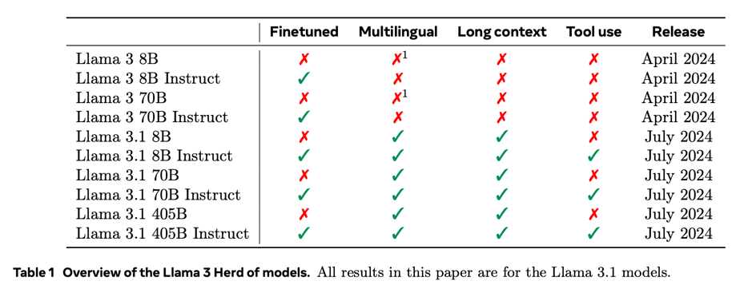

开发高质量基座模型的三个关键要素：data，scale，managing complexity

1. Data：在模型训练的两个阶段都提高了数据质量和数量。相比于Llama2，训练数据从1.8T增加到了15T，且增加了多语言数据。
2. Scale：our flagship language model was pre-trained using 3.8 × 1025 FLOPs, almost 50× more than the largest version of Llama 2。并且提到在后训练阶段使用了旗舰版模型去提升更小模型的能力。
3. Managing complexity：选择了使用标准的dense模型，而不是MoE模型，来保证训练的稳定性。在后训练阶段使用SFT+RS+DPO，而放弃了更复杂的RLHF，也是为了稳定的训练。

同时表示，也在开发模型的图片、视频和音频理解能力，进行中。

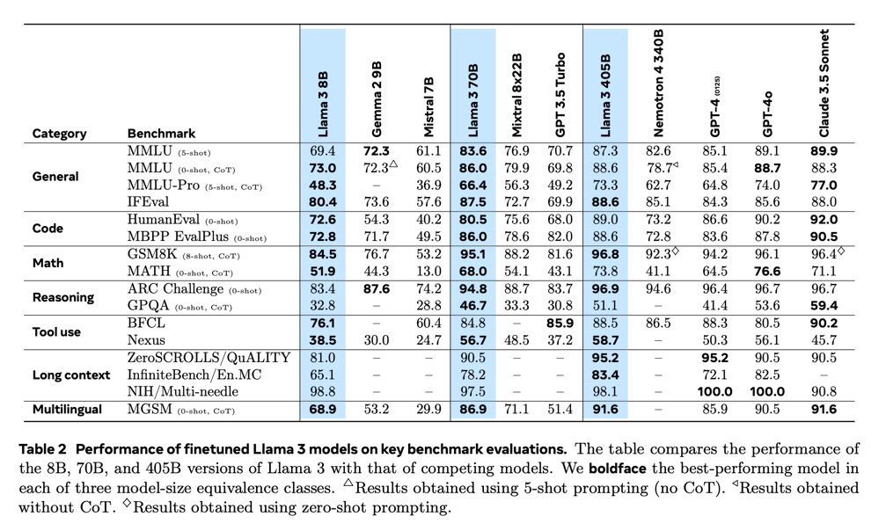

# General Overview

模型结构如下：
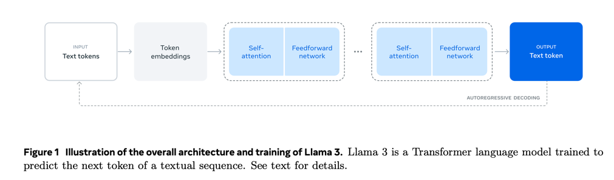

文章的整体概述：

* 预训练：
405B在15.6T上预训练，窗口大小8k 最后在128k窗口上继续预训练
* 后训练：
SFT、DPO（会进行**多轮**人工标注，疑似online方式？） 。增加tool-use技能、大幅提高编码、推理技能、安全
* 能力上：
可以至少使用8种语言回答问题，可以写高质量代码，可以解决复杂推理问题，可以使用工具out-of-the-box or in a zero-shot way
* 多模态：
图像encoder：自己训练的 图像-文本对齐；
语音encoder：mask 式MLM自监督；
图像adapter、语音adapter：（见下）

Our speech encoder is trained using a self-supervised approach that masks out parts of the speech inputs and tries to reconstruct the masked out parts via a discrete-token representation.

我们的语音编码器使用自监督方法进行训练，该方法屏蔽掉部分语音输入，并试图通过离散令牌表示重建被屏蔽的部分。


# Pre-Training

语言模型预训练包括:

(1)大规模训练语料库的管理和过滤，

(2)模型体系结构的开发以及用于确定模型大小的相应缩放定律，

(3)大规模高效预训练技术的开发，

(4)预训练配方的开发。

## Pre-TrainingData

训练数据截止到 2023年末

在每个数据源上应用了几种重复数据删除方法和数据清理机制，以获得高质量的token。


### Web Data Curation

- PII and safety filtering：有害内容过滤。个人信息网站、成人内容网站、有害网站
- Text extraction and cleaning
  - 定制 HTML 解析
  - 特殊处理数学和代码内容，保留结构信息
  - 保留 image alt 属性，数学相关
  - markdown 是有害的，删除了所有 markdown 的标记
- De-duplication
  - URL-level de-duplication：同一个 url，保留最新的版本 
  - Document-level de-duplication：全局去重，使用 Minhash。 
  - Line-level de-duplication：在一个 bucket（30M文档）中，如果一行出现了 6 次，则删除该行。 
    - 好处：可以去除一些网页的导航、cookie等网页的结构文本。 
    - 坏处：可能去除高质量的高频文本。 
    - 整体的评测是变好了。 
- Heuristic filtering：启发式过滤，删除低质的文本。
  - 策略： n-gram 重复比例、脏词比例、token分布不一致(与训练语料的token分布比较，该文档的token中有很多异常token)
- Model-based quality filtering 
  - 使用fasttext 识别一个文本是否被 wikipedia 引用
  - 通过创建一个清理过的网页文档训练集并描述质量要求，来训练基于 Llama 2 的质量分类器。
  - 使用 Llama 2 的chat模型来判断文档是否符合质量要求
  - 为了提高效率，使用 DistilRoberta 生成每个文档的质量评分。
- Code and reasoning data
  - 建立了一个 domain-specific 的 pipeline 抽取代码和数学相关的网页
  - 分类器：DistilRoberta 模型，训练数据是 llama2 标注的
  - 考虑了代码和数学的 token 分布跟自然语言的不同
- Multilingual data
  - 与英语类似
  - fasttext 做语言分类，分成176种语言
  - 对每种语言再采取文档级别和行级别的去重
  - 启发式+模型，删掉低质量数据

### Determining the Data Mix

使用 知识分类 和 尺度定律 来决定不同数据的比例

- Knowledge classification
  - 开发了分类器来分类网络数据中的信息类型
  - 用上述分类起对在网络上过度代表的数据类别（如艺术和娱乐）进行下采样
- Scaling laws for data mix
  - 通过规模定律实验来确定最佳数据组合
  - 训练几个小模型并预测大模型在相同数据组合上的表现
  - 重复此过程以选择新的数据组合候选，然后在该候选数据组合上训练一个较大的模型并评估其在几个关键基准上的表现。
- Data mix summary
  - **50%的通用知识，25%的数学和推理，17%的代码，和8%的多语言文本**

### Annealing Data

发现使用少量高质量的代码和数学数据进行退火可以激发模型的性能

通过数据组合对特定领域的高质量数据进行上采样，不包括常用基准的训练集，以评估Llama 3的少样本学习能力和域外泛化能力。

退火的效果：
- 8B模型的GSM8K提升了24%，MATH提升了6.4%
- 405B模型效果不大
  - 解释：405B模型具有强大的上下文学习和推理能力，无需特定领域的训练样本

- Using annealing to assess data quality.
  - 退火使得我们能够判断小型领域特定数据集的价值。
  - 通过将50%训练好的Llama 3 8B模型的学习率线性退火至0，在40B tokens上进行实验，给新数据集分配30%的权重，其余70%权重分配给默认数据组合。
  - 使用退火评估新数据源比对每个小数据集进行规模定律实验更高效。


## Model Architecture

标准的transformer架构，认为提升主要源于架构外的“数据质量、多样性、scale的增大”

（「our performance gains are primarily driven by improvements in data quality and diversity as well as by increased training scale.」）

尽管如此，仍有小改动：

- 使用GQA：
  - 8 key-value head；
  - 提升推理时的速度
  - 减少decoding时的kv cache
- 使用reset attention mask： 
  - 在8k窗口下PT时没什么影响；
  - 在CPT训练128k窗口时很重要。
- 128K 词表大小
  - gpt3.5的10W tokens + 28K non-English tokens
  - 相比于 llama2，英语数据的压缩率 3.17 -> 3.94 （每个token的平均字符数）
  - 新加的 non-English tokens没有影响英语的tokenization
- ROPE
  - theta 增加到 500000
  - 支持更长文本

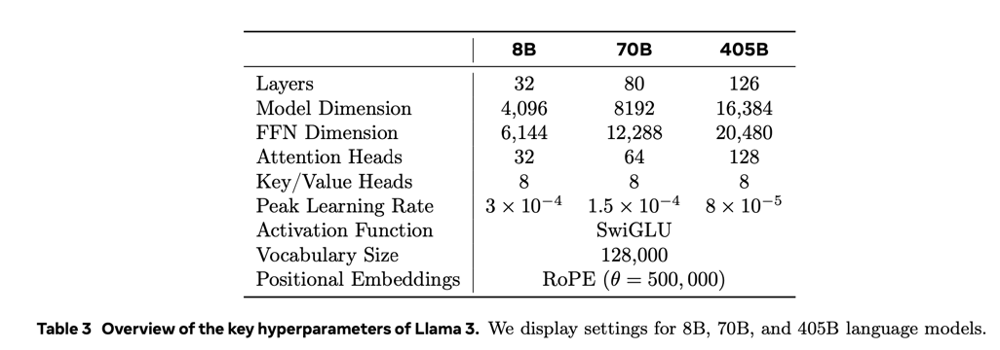

### Scaling Laws

使用 Scaling Laws 来计算在可以拿出来的预训练计算预算下旗舰版模型的最佳尺寸。

一个创新点：除了计算旗舰版模型的最佳尺寸外，还预测了模型在下游评测任务上的性能，两方面的原因：

本节主要包含两点：

- 计算最优：怎么得到一个“计算最优”的数据 vs 模型尺寸配比
- 指标预测：怎么在训练开始前就可以预测模型在指标上的表现

经典的 Scaling Law 公式：

- 计算预算(FLOPs) = 6 * 数据(Tokens) * 模型尺寸(Model Parameters)

怎么理解这个公式？

- 计算预算可以理解为多少卡 * 多少天
  - 比如，100 台 A800，训练一个月。一块 A800 目前能达到最好的吞吐大概是 210 TFLOPs/GPU，那么总预算就是：210 * 10^12 * 100 * 8 * 30 * 24 * 3600 = 4.35 * 10^23 FLOPs
- 其他单位
  - Tokens: 一般我们都说训练用了多少"T"的Token，1T Token = 1*10^12
  - 参数数量: 一般都说这个模型多少"B"，1B 参数 = 1*10^9
- 那我应该训练多大的模型？
  - 根据公式，给定预算后，数据量和模型尺寸是成反比的。即，要么用大量数据训练一个小模型，要么用少量数据训练一个大模型。
  - 比如说如果想要在这一个月内训练一个 7B 的模型，可以训练的 Token 数 =(4.35 * 10^23) / (7 * 10^9) / 6 = 10*10^12，大概就是 10T 的 Tokens。
  - 这一个月如果训练一个 70B 的模型，同理，就是 1T Tokens。
- 除了决定训练多大的模型，预测这个模型在下游任务的表现也很难，因为：
  - 现有scaling law 都是预测loss，并不能直接给出任务的表现
  - 现有scaling law 都是在小模型上做的，具有噪声，不可信
- 为了解决这个问题，本文：
  - 拟合了下游任务Loss和训练FLOPs的关系。
  - 拟合了下游任务Loss和任务准确率的关系。 
    - **使用scaling law 小模型和llama2的大模型的实验结果。**
- 通过这样，可以在给定计算资源后，预测模型在下游任务上的表现。


**Scaling law experiments.**

- 第一步，需要找到给定资源下，最优模型的设置。

  - 实验采用 6x10^18~10^22FLOPs 的预算范围
  - 每个预算下，训练40M~16B的模型
  - 超参数设置
    - 2000warmup
    - 最高学习率 2e-4~4e-4
    - 余弦退火，最小学习率为0.1x最高
    - weight decay（l2正则系数）=0.1*学习率
    - 固定batch size 250K～4M
  - 为了绘制下图中的 IsoFLOPs curves，需要做很多实验, 下图的每个点都代表一个实验
    - 可以理解成一个三元组（模型参数，数据量，Loss）
    - 用二次函数拟合相同FLOPS的实验
    - 抛物线的最小值为计算最优模型
    - 预算越高，抛物线越平。所以对于旗舰模型，在token和模型大小的选择上是更鲁棒的。

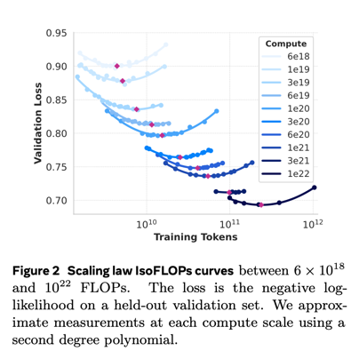

- 有了计算最优模型，下一步就是要预测给定预算下，用多少的Token训练大的模型了。

  - 输入C：计算预算
  - 输出Token数量
  - A和alpha是需要拟合的参数

  
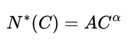

使用上图的最优模型（粉色点）来拟合这个公式：

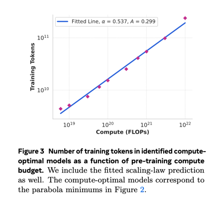

然后外推，3.8e25 FLOPS，得到需要使用16.55T tokens 训练 402B 的模型，是最优选择。

验算：

Tokens = 0.299 * (3.8 * 10^25)^0.537 = 16,293,522,313,716 = 16.29T
Model size = 3.8 * 10^25 / 16,293,522,313,716 / 6 = 388,702,529,225 = 388B


**Predicting performance on downstream tasks**

预测模型在 task 上的表现

第一步，使用线性拟合正确答案的NLL loss和FLOPs的关系（这里使用前面实验的scaling law 小模型）

第二步，使用sigmoid拟合Loss和准确率的关系（这里使用小模型+llama2）

在ARC Challenge（一个高难度选择题评测）上，4个数量级的外推非常准确，只轻微低估了旗舰模型的表现。

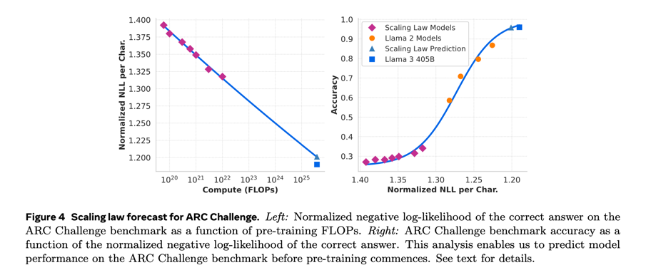

## Infrastructure, Scaling, and Efficiency

Llama3 405B 模型预训练背后的基础设施和几个可以改进训练效率的优化点。

### Training Infrastructure

- 16k*H100 GPU
- 240PB存储，
- RoCE网络，400Gbps带宽。
  - 网络拓扑：
    - 24k GPU 由三层拓扑连接 
    - 底层连接两个node（2*8=16GPU） 
    - 中间层192 rank组成一个pod(192*16=3072)，能够利用到全部双向带宽。 
    - 顶层由8个pod组成(8*3072=24k)。超售比1:7 
    - 并行策略和调度具备拓扑感知，降低跨pod通信。
  - 负载均衡
  - 拥塞控制


### Parallelism for Model Sacling

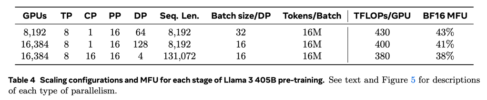

- 使用了4D并行
  - 4D分别是 Tensor P、Context P、Pipeline P、Data P

并行化技术的补充：

张量并行性（Tensor Parallelism）：将单个权重张量分割成多个部分，分布在不同的设备上。

流水线并行性（Pipeline Parallelism）：将模型垂直地划分为多个阶段，每个阶段由若干层组成，不同设备可以并行处理模型的不同阶段。

上下文并行性（Context Parallelism）：将输入上下文分割成多个部分，以减少对于非常长序列长度输入的内存瓶颈。

全参数分片数据并行性（Fully Sharded Data Parallelism, FSDP）：

* 将模型、优化器和梯度分片化。
* 实现数据并行性，即在多个GPU上并行处理数据，并在每个训练步骤后进行同步。
* 在Llama 3模型的应用中，**FSDP用于分片优化器状态和梯度。**
* 模型分片后，在前向计算之后不重新分片，以避免在反向传播期间进行额外的全收集（all-gather）通信。


- 使用了FSDP
  - 对优化器，梯度切片（类似zero2）
- GPU利用率：38%-43%的 Model FLOPs Utilization （MFU）

- Pipeline parallelism improvements.
  - 问题 
    - Batch size 的限制：目前 interleaved PP 限制，比如M 必须被 PP 整除
    - 显存不均衡：第一个stage消耗很多显存，因为多了embedding
    - 计算不均衡：最后一个stage需要计算输出和loss
  - 解决方案
    - 如下图所示的设计，可以支持随意调整N的大小（之前N必须=PP）
    - 第一个PP和最后一个PP只有embedding和lmhead。
    - 开启TORCH_NCCL_AVOID_RECORD_STREAMS减少异步点对点通信产生的显存占用
    - 进行了详细的显存profiling，手动释放未来不会使用的显存，包括每个pp stage的输入和输出tensor
    - 经过这些优化，他们能够不使用activation checkpointing就能训练8k的长度

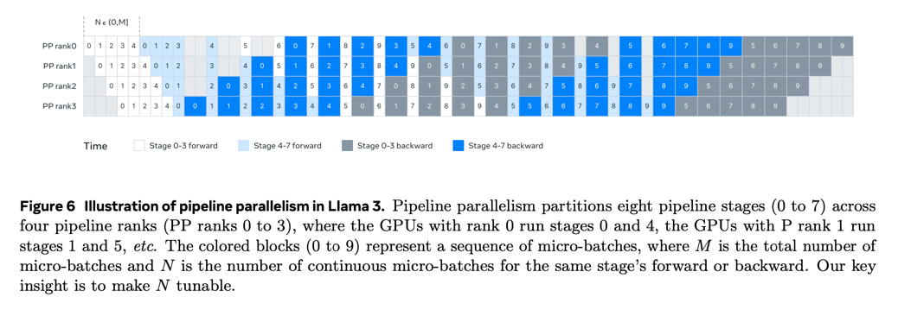


## Training Recipe

8B、70B 和 405B 三个模型都采用了相似的训练流程。

整个训练流程分为三部分：

- 初始预训练阶段 (initial PT)
- 长上下文预训练 (long-context pre-training)
- 退火（annealing）

### Initial Pre-Training

- llama3 405B 
  - 余弦学习率，
  - warmup 8000 steps，
  - 8e-5 → 8e-7 (over 1,200,000 training steps)
  - batch size
    - 初始阶段使用小batch size(为了提升训练的稳定性)
    - 之后逐渐提升(为了提升训练效率)。 
    - 初始batch size 4M tokens per batch，seqlength 4096。 
    - 在训练了252M tokens之后(63个step)，提升至8M tokens per batch，seqlength 8192。
    - 这样训练了2.87T tokens之后，提升至16M tokens per batch。
    - 他们观察到这样的训练是非常稳定的，没有loss异常值。
- 调整数据组合： 
  - 增加了非英语数据的百分比，以提高llama3的多语言性能。 
  - 对数学数据进行上采样，来提升模型的数学推理能力。 
  - 在训练后期，加入了更多的近期的网络数据来提升模型的知识截止时间。 
  - 对认定的偏低质量数据进行了下采样。


### Long Context Pre-Training

- 在预训练的最后阶段，在128K长度的序列上进行。 
- 不会提前训练长序列，因为自注意力层中的计算量随序列长度呈二次方增长。 
- 长度的增加不是一次到位的，而是逐步增加。 
- 如何评估模型是否适应当前长度：
  - （1）在短长度的评估任务指标完全恢复。
  - （2）在当前长度可以完美解决大海捞针任务。
- 在405B的预训练中，分了6个阶段来逐渐增加上下文长度从8K到128K，整个过程训练了800B token。

### Annealing

- 对最终的40M token进行退火，将学习率线性退火至0。(退火5个step？)
- 退火期间保持128K token的上下文长度。
- 退火数据详见3.1.3
- 最终模型：退火期间检查点的平均


# Post-Training

经过了几轮后训练来进行 llama3 模型的对齐，每轮使用标注数据和合成数据 SFT 和 DPO

## Modeling

后训练策略的 backbone 是 一个奖励模型 + 一个语言模型。

首先使用人类标注偏好数据基于最新的预训练 checkpoint 训练了一个奖励模型。

其次，通过 SFT 和 DPO 微调预训练的 checkpoint。如图。主要讨论了 llama3 405B的后训练流程。

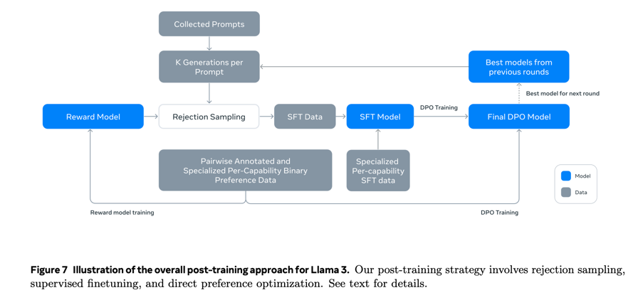


### Chat Dialog Format

Llama 3 相较于其前身，引入了一些新功能：
- 工具使用：Llama 3 能够使用工具，这可能涉及到在单次对话中生成多个消息。
- 多消息协议：为了支持这种功能，Llama 3 设计了一种新的多消息聊天协议。
- 特殊头部和终止令牌：
  - 头部令牌：用于指示每个消息在对话中的来源和目的地。例如，消息可能会被发送到 user 或 ipython。
  - 终止令牌：用于指示何时轮到人类和人工智能交替发言。
这些新特性使得 Llama 3 在处理复杂对话和多任务交互时更加灵活和高效。

### Reward Modeling

  - 相比于 llama2 的去掉了 margin loss，因为在数据提升（data scaling）后没啥提升
  - 除了 chosen > rejected，多了 edit（对 chosen 再改写） > chosen
  - 训练目标由 (r_chosen-r_reject-margin > 0) 变成 ((r_chosen-r_reject > 0))

什么是 margin loss？

在机器学习和深度学习中，损失函数（Loss Function）是用来衡量模型预测值与实际值之间差异的函数。
损失函数的目的是提供一个量化的指标，帮助模型通过优化过程来最小化这个差异。

损失中的边际项（Margin Term）通常出现在特定的损失函数中，如Hinge Loss或Softmax Loss等。
边际项的主要作用是为损失函数增加一个额外的约束，使得模型在做出正确预测时，不仅仅是预测值接近实际值，而是要显著地优于错误的预测。

在上文提到的情境中，移除损失中的边际项可能是因为在数据缩放后，边际项带来的改进变得不那么显著，或者边际项对于模型性能的提升已经达到了饱和点，因此为了简化模型或提高训练效率，选择将其移除。


### Supervised Finetuning

- SFT 用的是拒绝采样数据，
- 强调：many of the training targets are model-generated
- 最大的模型使用 1e-5 的学习率训练了 8.5K 到 9K 步


### Direct Preference Optimization

- 在数据上，优先使用前一轮偏好对齐后的模型生成的数据
- 只用了 off-policy 的 DPO，没用 PPO，因为快，对指令遵循（IFEval）效果好
- 学习率 1e-5，beta 设置成 0.1
- 对 DPO 做了一些修改：
  - Masking out formatting tokens in DPO loss
    - mask 掉了 Chat ML 的 token，因为对训练有影响（推测它让 chosen 和 rejected 像了）
      - 这些 token 可能导致模型重复输出或者突然终止
  - Regularization with NLL loss
    - 加了  NLL loss 防止 chosen 的结果 logits 太低

### Model Averaging

把 SFT/DPO 阶段使用不同参数or数据的模型进行了平均


### Iterative Rounds

整个 SFT→ DPO 过程迭代 6 轮

## Post-training Data

### Preference Data

- 标注数据生成
  - 对于任意一个prompt，从多个模型中随机筛选出两个进行回复。标注人员从两个回复中选取一个更好的，并对偏好强度进行四级评价。
  - 允许标注人员为prompt修改出一个最佳回复（edited > chosen > rejected）
  - 用于生成回复的多个模型，是由不同的数据组合训练出来的
  - 在每轮训练后，针对模型表现不好的领域，采样更复杂的prompt进行标注
- 标注结果统计（Table 6）：prompt和response都比llama2更长
  - 平均对话轮数3.8
  - 每个样本平均长度1041 tokens
  - prompt平均长度44.5tokens
  - 回复平均长度284tokens
- 标注数据使用：
  - 所有的偏好数据都会用来训练reward model
  - 只用最新一轮的数据进行DPO
  - 只筛选偏好强度属于最高两级的数据进行训练

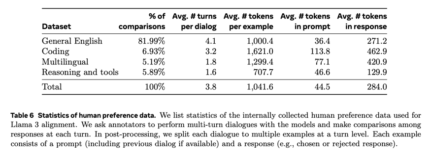


### SFT Data

- 来源统计：1）人工撰写的prompt（用rejection-sampling进行筛选）；2）特殊领域的合成数据（见4.3）；3）少量人工整理的数据（见4.3）
- Rejection sampling：
  - 对于任意一个promp，都会从当前最优的chat模型中采样出K个回复（k通常在10-30之间）
  - 用reward model从K个回复中选取最好的一个
  - 在后期的训练中，会用不同的system prompt来控制不同能力下，模型回复的语气，风格(style)或者格式(format)
  - 利用 PagedAttention 中的dynamic kv cache allocation加速rejection sampling中回复的生成速度。生成速度x2
- 数据领域统计（Table 7）
  - 通用：52.66%；推理和工具使用：21.19%；代码：14.89%；考试型问题：8.14%；多语言：3.01%；长文本：0.11%
  - 平均对话轮数：4.7，每条样本平均长度846.1tokens，context平均长度535.7 tokens， 最终回复平均长度：310.4 tokens
  - 每轮训练都会根据模型表现调整训练数据的比例，高质量数据可能多重复几次，低质量数据会被下采样。

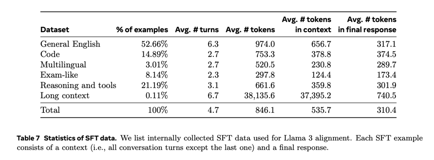


### Data Processing and Quality Control

- 由于绝大多数数据都是模型生成的，所以需要严格的清洗和质量控制
- 规则清洗
  - 用规则去掉或者修改一些不想要的模式，比如过多的emoji，过多的感叹号，过多的“I'm sorry", "I apologize"
- 基于模型的数据清洗：
  - Topic classification：用llama3 8B作为分类器，将数据在粗、细两个维度进行分类。类别例子”数学推理“ - ”几何“
  - Quality scoring：
    - reward model：选择RM score在前1/4的数据作为高质量数据
    - Llama-based model：用大模型进行3级（通用英语数据）或者2级（代码数据）打分，得分在最高等级的数据被认为是高质量数据
    - 被任意一种方式标记为高质量的数据都会被采用
  - Difficulty scoring： 用llama3 70B对SFT prompts的难度进行打分，比如意图更多的prompt被认为难度更大
  - Semantic deduplication： 
    - 语义去重，用bert对对话进行聚类，
    - 在每个聚类中用quality score × difficulty score进行排序
    - 仅保留与聚类中迄今为止看到的示例的余弦相似度小于某个阈值的对话

## Capabilities

讲了模型的几种能力和增强方法，大量使用了合成数据

## Code

- 增强code能力的几种方法：（一切为了高质量数据）

  - 训练代码专家(code expert)：
    - 用 1T token的code data做CPT，最后几k个step做长文本CPT（16k token)，然后参照4.1做了alignment
    - 作用：产生合成数据，拒绝采样

  - 生产合成数据：三种合成方法，最终产生2.7M的数据（给SFT）
    - 执行反馈(execution feedback )，确保正确性 **(1 M)**
      - 已知的经验是405B用自己生成的数据训练没有用，甚至能力还下降了，所以需要提升回答质量和正确性
      - 具体步骤：
        - 产生问题和回答：让模型根据不同来源的代码片段生成问题，并产生回答（自造问题，自造回答） 
        - 正确性检测 
          - 静态分析：用parser和linter，检查是否有语法错误，引用未定义变量，typing errors等等 
          - 单元测试：让模型生成测试case，运行代码，检查错误 
          - 错误反馈和自我修正： 
            - 如果哪项没过，就提示模型修正，只取两项都通过的才会加入SFT 
            - 过程中发现有20%的数据一开始错了，但是最后修正对了，因此这个方法是有用的 
          - 迭代训练：用上一轮improved的模型生成higher quality的数据
    - 编程语言翻译：解决less common编程语言训练数据少的问题，在 MultiPL-E 上有显著提升 
      - 举例：Python -> PHP （Fig 8）
      - 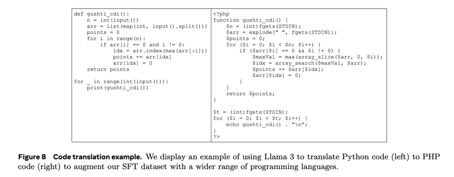
    - 回译/反向翻译（**1.2M**），有些能力通过执行反馈不好评测，比如代码解释，
      - 先产生正向数据，比如给代码加注释，或者让模型解释代码 
      - 让模型回译成代码，比如从代码的解释里生成代码 
      - 用原本的代码做ref，llama3评估回译的代码，得分高就加入SFT

  - 拒绝采样期间用system优化格式
    - （readability, documentation, thoroughness, and specificity）
    - 目的是提升质量(code quality) 
    - 例子 （Fig 9）增加注释，修改变量名，更好理解
    - 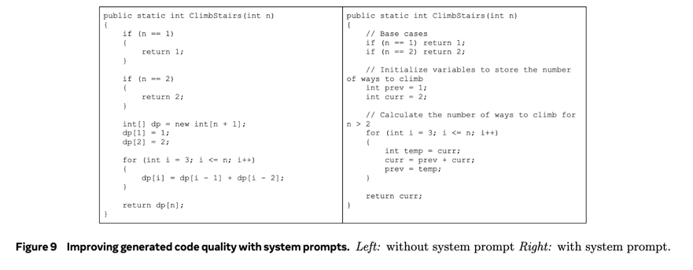

  - 使用执行和模型作为裁判信号过滤训练数据
    1. 过滤训练数据：使用执行和模型作为裁判的信号来过滤训练数据。
    2. 质量问题：在拒绝采样的数据中偶尔遇到质量问题，例如包含错误的代码块。
    3. 检测挑战：对于混合自然语言和代码的拒绝采样响应，检测这些问题并不像合成代码数据那样直接。
    4. 模型作为裁判方法：使用早期版本的Llama 3评估并根据代码正确性和代码风格两个标准分配二元（0/1）分数。
    5. 样本筛选：只保留获得完美2分的样本。
    6. 过滤导致性能下降：严格的过滤最初导致下游基准性能下降，主要是因为它**不成比例地移除了具有挑战性的提示的示例。**
    7. 策略性修订：为了对抗这种性能下降，**有策略地修订**了一些被归类为最具挑战性的编码数据的响应，直到它们满足基于Llama的“模型作为裁判”的标准。
    8. 质量与难度平衡：通过完善这些具有挑战性的问题，编码数据在质量和难度之间实现了平衡，从而实现了最佳的下游性能。


### Multilinguality

和code类似，先训专家，然后产生数据（给PT）

* 训练多语言专家
  - 在PT中途，用 非英文token占90%的 数据做CPT，然后参照4.1做alignment
  - 上述模型也一直为后续的PT产生非英文数据
* SFT数据来源（非合成）
  - 人工标注 2.4%，人工指语言专家和native speaker，问题类型主要是开放问题
  - 其他的NLP任务 44.2%
  - 拒绝采样数据 18.8%
  - 翻译数据 34.6%，尽量避免用机翻数据，例外是逻辑推理的数据是翻译的，因为发现翻译后质量没下降

### Math and Reasoning

列举了一些问题和相应的解决方案


### Long Context

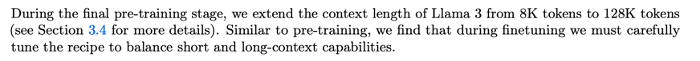

发现（上图）：在PT阶段已经做过长文本训练，如果在SFT阶段只用短文本训练，长文本能力损伤较大

考虑到长文本标注的难度和成本，主要依赖于合成的长文本数据

获取长文本的的三个来源：
1) QA，
2) summarization
3) 代码依赖关系推理(去掉代码库里的关键文件，问模型哪些文件依赖这个文件

所以SFT长短混合，长：短=1:1000，长文本又分为 16k 、32k、 64k 、128k 四种

并且发现如果SFT能够平衡长短上下文，那DPO只用短的不会影响长文本能力，所以DPO阶段只用了短的


### Tool Use

可以调用的工具：

- 搜索引擎 Brave Search
- Python interpreter 
- 数学工具 Wolfram Alpha API
- 自定义工具（zero shot tools）

应用方式：

- 核心工具都是Python定义。自定义工具需要python函数和帮助文档，使用时用函数签名和文档作为上文
- 工具全部通过python解释器调用，需要在system里指定，可以在system里单独启用/禁用

工具数据集能力的构造：让Llama3按照要求造数据，用来SFT

- 单步工具使用：few shot方式构造问题和答案，最后调用成功的数据加进数据集，数据构成「system prompt, user prompt, tool call, tool output, final answer」
- 多步工具使用：和单步的类似，区别是需要产生能调用多个工具的数据「system prompt, user prompt,(tool call, tool output)*n, final answer」
  - 多步工具使用的例子
  - 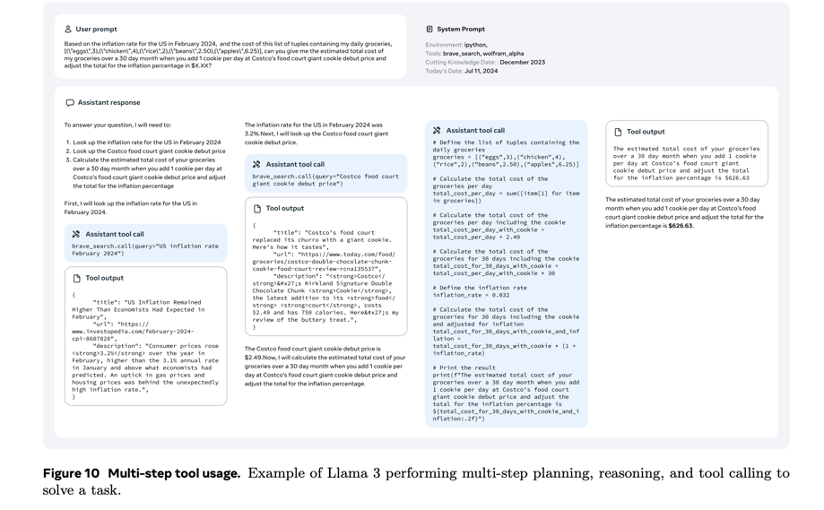
- 文件上传：上传文件进行特定任务

自定义工具使用能力的构造：用大量「functions definitions, user query, corresponding call」数据训练模型（没讲怎么来的）


### Factuality

幻觉仍然是大型语言模型面临的主要挑战。

模型往往过于自信，即使在他们知之甚少的领域也是如此。

尽管存在这些缺点，但它们经常被用作知识库，这可能导致错误信息传播等危险后果。

虽然我们认识到事实可以超越幻觉，但在这里采取了幻觉优先的方法。

- 后训练的原则：遵循的原则是使模型在训练后能够“知道自己知道什么”，而不是增加知识。
- 数据生成方法：通过生成数据来确保模型生成的内容与预训练数据中的事实数据子集一致。
- 利用Llama 3的上下文能力开发了一种知识探测技术。
- 数据生成过程：
  - 提取预训练数据中的一个数据片段。
  - 通过提示Llama 3生成关于这些片段的事实性问题。
  - 从Llama 3采样对问题的回答。
  - 使用原始上下文作为参考，以Llama 3为裁判，评估生成内容的正确性。
  - 以Llama 3为裁判，评估生成内容的信息量。
  - 对那些在生成中一贯信息量大但错误的回答，使用Llama 3生成拒绝回答。
- 鼓励模型回答：使用知识探测生成的数据鼓励模型只回答它知道的问题，并拒绝回答它不确定的问题。
- 预训练数据的局限性：预训练数据并不总是事实一致或正确的。
- 收集事实性数据：因此，还收集了有限的标记事实性数据，这些数据涉及敏感话题，其中普遍存在事实矛盾或错误的陈述。

### Steer ability

```markdown
Steerability is the ability to direct the model’s actions and outcomes to meet developer and user specifications.

可操纵性是指指导模型的动作和结果以满足开发人员和用户规范的能力。

```

（大致就是对于system的指令遵循能力）

数据收集：主要依赖人工

- 人工构造不同的system，与模型对话后评估指令遵循能力
- 这份数据用在了 reward modeling, rejection sampling, SFT, and DPO


# Result

该部分主要对预训练模型和instruct（post-trained）模型以及 llama3 的安全性能进行了评测

## Pre-trained Language Model

### Standard Benchmarks

包含了以下测试集

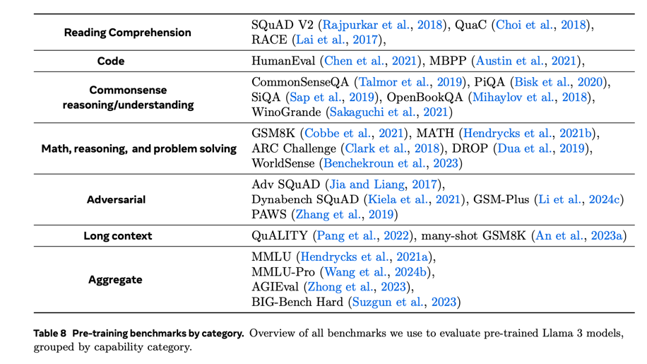

对于其他同尺寸的模型，也自己进行了重新测试，为了公平，选择了自己的测试结果和报告结果中最好的那一个。

因为单次测试具有偶然性，特别是一些测试集，偶然性较大，所以他们进行了多次测试，在95%置信区间内计算最终的测试结果。具体的计算方式为：
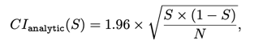

S 是在评测集上的 Score，N 是评测集的样本数量

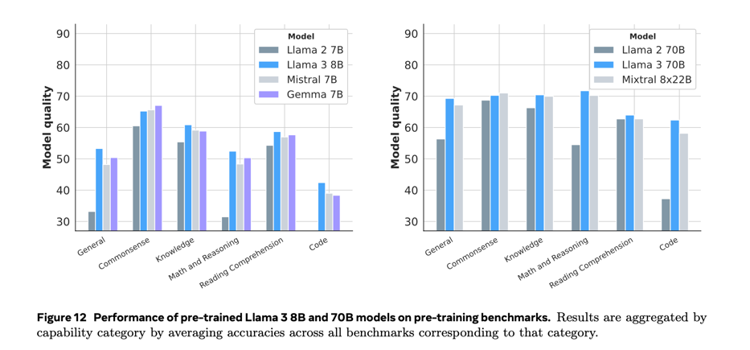

llama3 8b和llama3 70b与其他同水平模型的对比。llama3 8b很多方面都是第一。llama3 70b相比于llama2 70b，只有常识部分的没什么提升，大概是因为这部分的知识已经饱和。llama3 70b也优于mixtral 8*22b。

具体各个类别的评测结果：

阅读理解和代码：

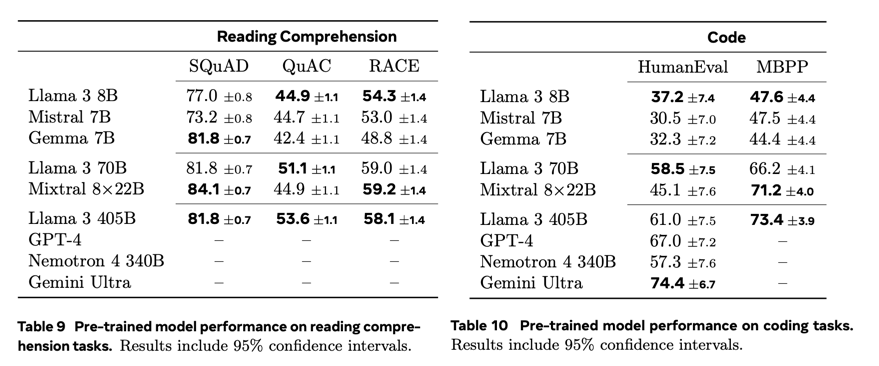


常识理解：

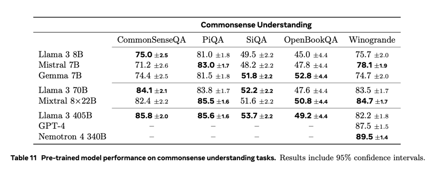

数学推理：

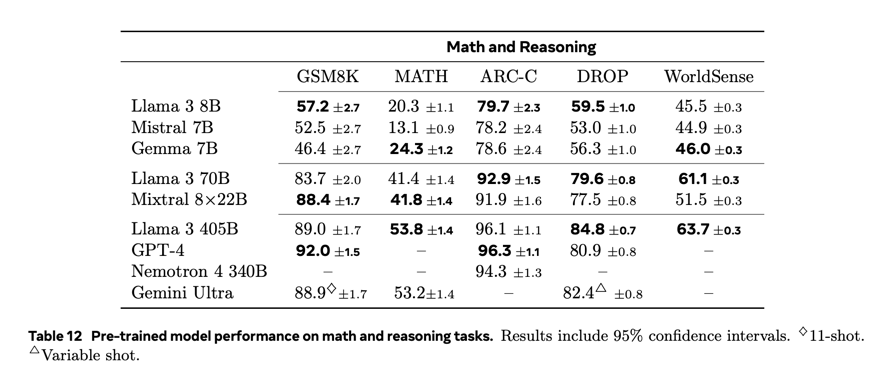

通用能力：

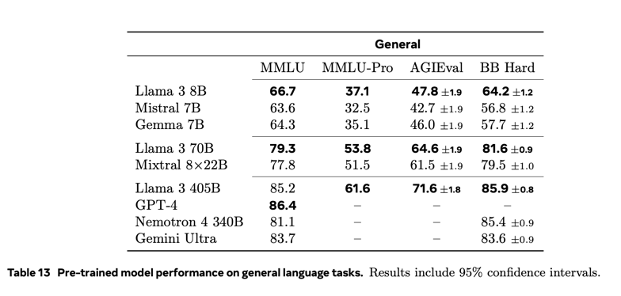

长文本：

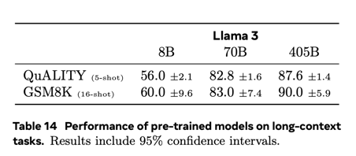

从这些来看，llama3 405b的代码能力相对有点差。别的几乎都是第一梯队，尤其在通用能力方面，llama3全面好于其他对比模型。


### Model Robustness

论文选取了多选题来测试模型的鲁棒性。之前的研究发现，模型对多选题很敏感。因此，这里使用了MMLU来评测多选题。多选题会受到如下因素的影响：（1）few-shot的影响（2）标签的变化（3）答案顺序（4）prompt格式。使用4-shot来测试。

few-shot影响：分别测试以下情况：（1）所有shot的答案都是相同的（AAAA）（2）所有shot的答案都是不同的（ABCD）标签（3）只有两种标签，（AABB和CCDD）。

标签变化的影响：选取了不同的标签名字：$ & # @、œ § з ü、A. B. C. D、A) B) C) D)、1. 2. 3. 4.。

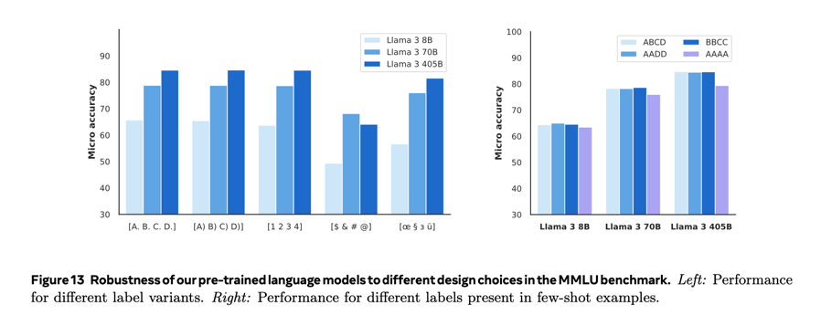

可以看出，llam3的鲁棒性还是比较好的。而且模型越大，对标签的鲁棒性越强。

答案顺序的影响：比如对于ABCD，AB的顺序不变，所有的C变成D，D变成C。


**prompt格式的影响**：

论文评估了五个任务提示的成绩差异，这五个任务提示所提供的信息水平各不相同：一个任务提示只是要求模型回答问题，而其他任务提示则声称模型具有专业知识或应选择最佳答案。


### Adversarial Benchmarks

对抗测试

对抗测试是检测模型是否对某些测试集有过拟合。对于QA，选取了Adversarial SQuAD和Dynabench SQuAD进行测试。对于数学推理，使用了GSM-Plus。对于意译检测，使用的是PAWS。非对抗测试，QA使用SQuAD，数学推理使用GSM8k，意译检测使用QQP。每个数据点都表示一个对抗测试和非对抗测试的配对。

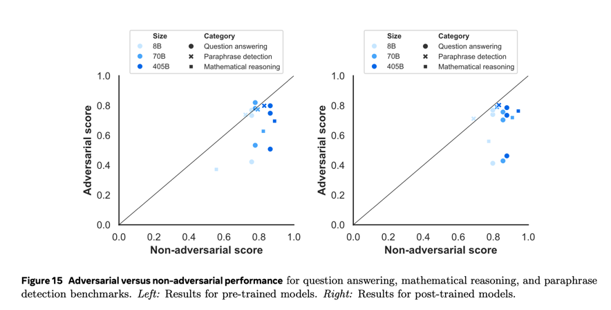

左图是预训练模型，右图是instruct模型。意译检测方面，模型是没有什么变化的。在数学推理方面，过拟合了一点。QA方面过拟合多一些。


### Contamination Analysis

污染分析

使用8-gram overlap来进行污染检测。判断测试数据是否在训练数据里面出现过。

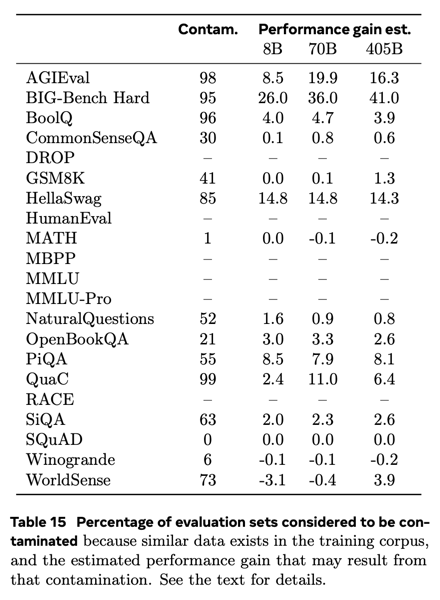

表中提供了污染分数和性能增益的结果，剔除了一些无意义的结果。

论文发现对于某些数据集，污染会产生很大影响，而对于其他数据集，污染则不会。例如，对于 PiQA 和 HellaSwag，污染估计值和性能增益估计值都很高。而对于 Natural Questions，估计的 52% 污染似乎对性能几乎没有影响。对于 SQuAD 和 MATH，低阈值会产生高水平的污染，但不会提高性能。这表明污染对这些数据集没有帮助，或者需要更大的 n 才能获得更好的估计值。

最后，对于 MBPP、HumanEval、MMLU 和 MMLU-Pro，可能需要采用其他污染检测方法：即使采用较高的阈值，8-gram 重叠也会产生很高的污染分数，以至于无法获得良好的性能增益估计


## Post-trained Language Model


### General Knowledge and Instruction-Following Benchmarks

测试集如下：
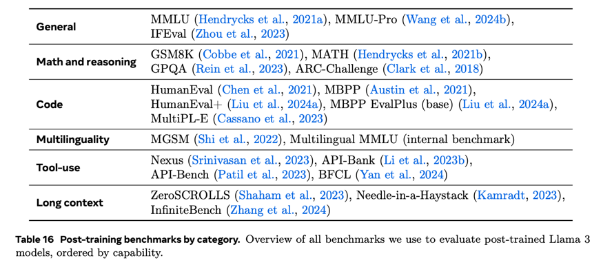

具体的评测方式与PT的类似。

instruct模型结果：

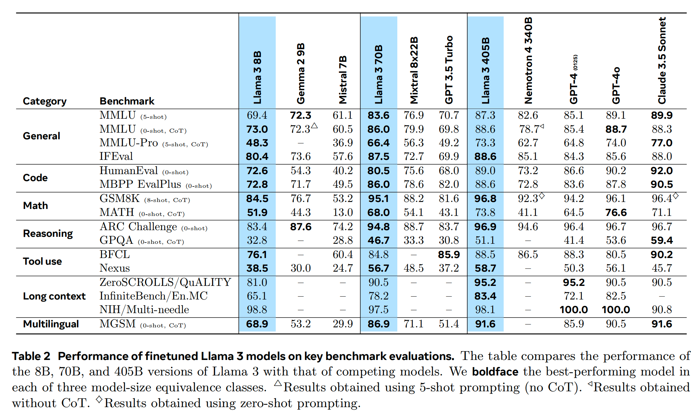

### Proficiency Exams

考试题：

* GRE： 官方 GRE 模拟考试 1 和 2（来自美国教育考试服务中心）；
* LSAT： 官方预测试 71、73、80 和 93；
* SAT： 官方 SAT 学习指南 2018 版中的 8 门考试；
* AP： 每个科目一次官方模拟考试；
* GMAT 官方 GMAT 在线考试。

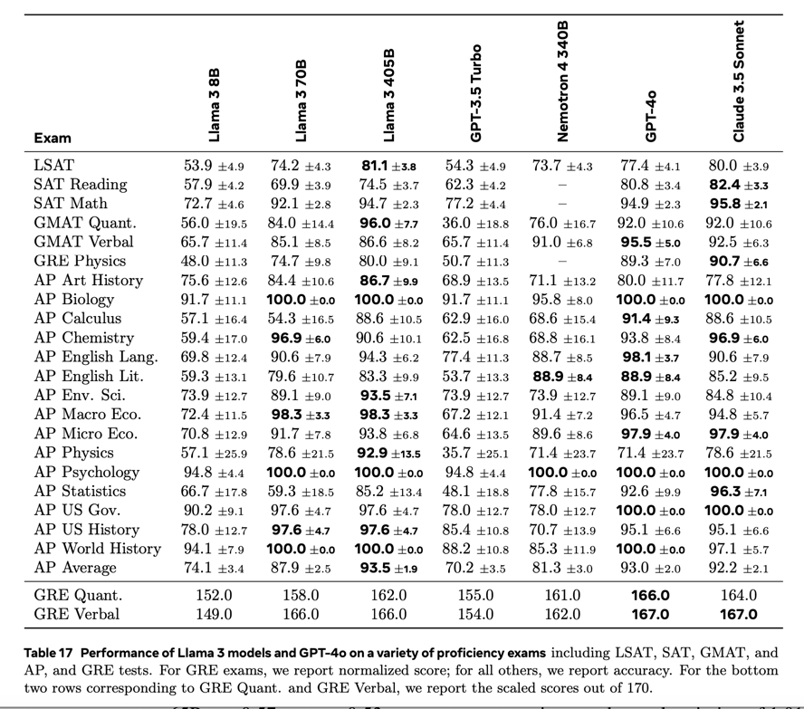

总结：llama3.1 70b比GPT 3.5 turbo厉害。llama3.1 405b跟GPT-4o、Claude 3.5差不多。


### Coding Benchmarks

只公布了 Pass@1

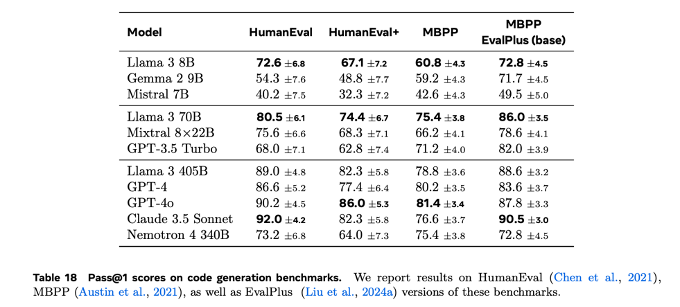


使用翻译后的代码测试多编程语言

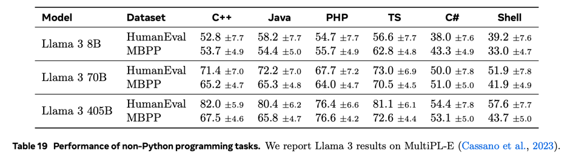


### Multilingual Benchmarks

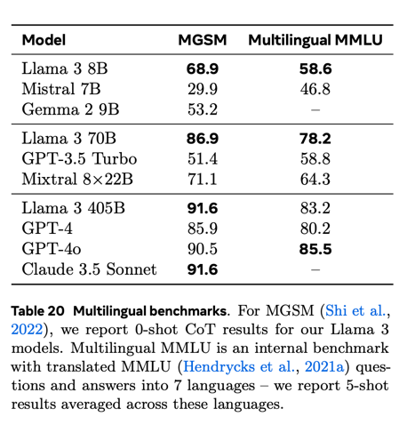

在 8B 和 70B 级别上，llama3.1厉害，符合预期，因为别的模型可能没有在小语种上去专门训练。

超大规模模型，都差不多。


### Math and Reasoning Benchmarks

Llama 3 8B 模型在 GSM8K、MATH 和 GPQA 上的表现优于其他类似大小的模型。我们的 70B 模型在所有基准测试中的表现都明显优于其他同类模型。最后，在 GSM8K 和 ARC-C 中，Llama 3 405B 模型是同类中最好的，而在 MATH 中，它是第二好的模型。在 GPQA 上，它与 GPT-4 4o 竞争，Claude 3.5 Sonnet 以显著优势成为最佳机型。

### Long Context Benchmarks

三个任务：

- Needle-in-a-Haystack（大海捞针）衡量的是模型检索长文档中随机插入的隐藏信息的能力。我们的 Llama 3 模型展示了完美的针式检索性能，在所有文档深度和上下文长度下都能成功检索到 100% 的针式信息。我们还测量了 “多针”（表 21）的性能，“多针 ”是 “干草堆中的针 ”的一种变体，我们在上下文中插入四根针，测试模型能否检索出其中两根。我们的 Llama 3 模型取得了近乎完美的检索结果。
- ZeroSCROLLS是一个针对长文本自然语言理解的零点基准。我们报告的是验证集的数据，因为地面实况答案并不公开。我们的 Llama 3 405B 和 70B 模型在这一基准中的各种任务上要么与其他模型不相上下，要么超过了其他模型。
- InfiniteBench 要求模型理解上下文窗口中的长依赖关系。我们在 En.QA（小说问答）和 En.MC（小说多选问答）上对 Llama 3 进行了评估，我们的 405B 模型在这两项任务上的表现优于其他所有模型。Llama 3 在 En.QA 和 En.MC 上的表现尤为突出。

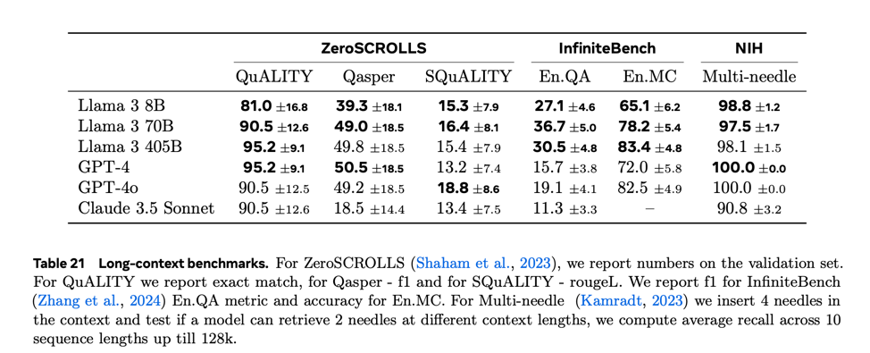

### Tool Use Performance

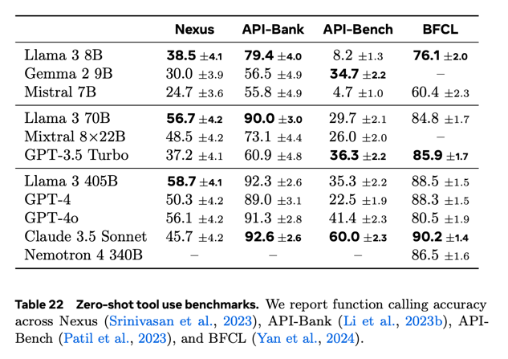

1. 在Nexus基准测试中，Llama 3的各个变体相比其他同类模型表现最佳。
2. 在API-Bank基准测试中，Llama 3的8B和70B模型在它们所属的类别中显著超越其他模型。
3. Llama 3的405B模型仅以0.6%的差距落后于Claude 3.5 Sonnet。
4. 在BFCL基准测试中，Llama 3的405B和70B模型表现出竞争力，在其各自的尺寸类别中排名第二。
5. Llama 3的8B模型在其类别中表现最佳。

总结要点是：Llama 3在多个基准测试中表现出色，特别是8B和70B模型在它们所属的类别中领先，而405B模型也展现出与顶级模型相媲美的性能。

另外，人工评估了代码执行和工具调用方面的能力，共测试了2000条case。

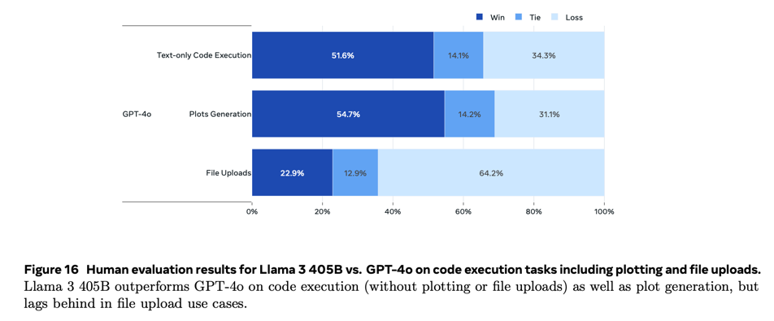

在纯文本代码执行任务和绘图生成方面，Llama 3 405B 明显优于 GPT-4o。不过，在文件上传使用案例中，它就落后了。

## Human Evaluations

prompt收集：收集了7,000 条提示，涵盖六种单项能力（英语、推理、编码、印地语、西班牙语和葡萄牙语）和三种多轮能力11 （英语、推理和编码）。我们确保在每个类别中，提示语在各个子类别之间均匀分布。将每个提示语分为三个难度级别，并确保我们的提示语集包含大约 10% 的简单提示语、30% 的中等提示语和 60% 的困难提示语。所有人工评估提示集都经过了全面的质量保证流程。建模团队无法访问我们的人工评估提示集，以防止意外污染或过度拟合测试集。

人工评估：人工进行AB盲评，使用7分制度：-3、-2、-1、0、1、2、3，只有2、3才会被统计为有效的win。将模型进行配对比较，统计胜率。

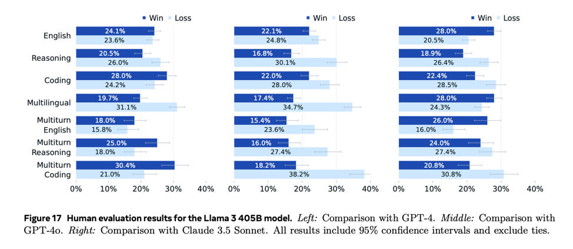

结果：我们使用人工评估程序将 Llama 3 405B 与 GPT-4（0125 API 版本）、GPT-4o（API 版本）和 Claude 3.5 Sonnet（API 版本）进行比较。我们发现，Llama 3 405B 的性能与 0125 API 版本的 GPT-4 大致相当，而与 GPT-4o 和 Claude 3.5 Sonnet 相比，其性能参差不齐（有赢有输）。在几乎所有功能上，Llama 3 和 GPT-4 的胜率都在误差范围内。在多轮推理和编码任务上，Llama 3 405B 的表现优于 GPT-4，但在多语言（印地语、西班牙语和葡萄牙语）提示上，Llama 3 405B 的表现低于 GPT-4。Llama 3 在英语提示方面的表现与 GPT-4o 相当，在多语种提示方面与 Claude 3.5 Sonnet 相当，在单匝和多匝英语提示方面则优于 Claude 3.5 Sonnet。不过，它在编码和推理等能力方面落后于 Claude 3.5 Sonnet。从质量上讲，我们发现模型在人类评估中的表现在很大程度上受到细微因素的影响，如模型音调、响应结构和词性，而这些因素正是我们在后期训练过程中要优化的。总体而言，我们的人类评估结果与标准基准评估结果一致： Llama 3 405B 与业界领先的模型相比具有很强的竞争力，是性能最佳的公开可用模型。
基准评估： Llama 3 405B 与业界领先的模型相比具有很强的竞争力，是性能最佳的公开可用模型。


## Safety

重点评估了llama3以安全和负责的方式生成信息的能力，同时保证最大化有效信息。预训练阶段，主要是数据清洗和过滤。微调阶段提出一个新的方法使得模型符合特定的安全策略，同时保留有用性。

* 评估了在多语言、长上下文、工具使用、多种模式能力，以测试安全策略的有效性。
* 对网络安全和化学和生物武器风险提升的评估。
* 描述了如何利用红队迭代识别和对抗各种安全风险，并进行剩余风险评估。
* 描述了系统级安全性，或者围绕模型本身的输入和输出开发和编排分类器，根据各种用例定制安全性并以更负责任的方式部署生成式人工智能。
* 

### Benchmark Construction


### Safety Pre-training


### Safety Finetuning


### Safety Results


### Cybersecurity and Chemical/Biological Weapons Safety


### Red Teaming


### System Level Safety


### Limitations