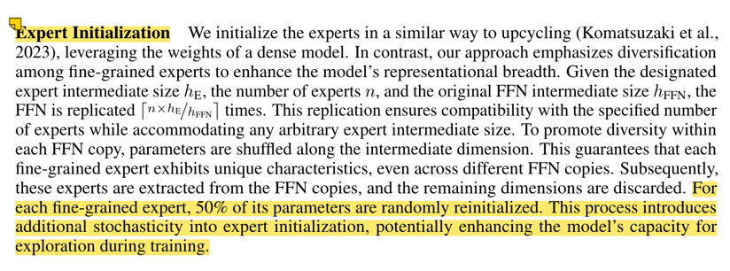

# 训练 tokens 量
- Qwen1.5的时候用了 3T tokens
- Qwen2-0.5B 先用了 7T tokens，后再用了 7T tokens 放宽质量的 12T tokens。发现这两表现差不多
- 所以，其他 Dense 模型都是用 7T tokens 训练的
- Qwen2-57B-A14B 是从 Qwen2-7B 初始化来的，再这个基础上训练了额外的 4.5T tokens

# 长文本
先 4k 上下文，之后
- 32k
- base: 10,000 →  1,000,000
- YARN + Dual Chunk Attention 
  - YARN：https://arxiv.org/abs/2309.00071
  - DCA：https://arxiv.org/abs/2402.17463

仅 ppl 验证

# MoE相关

1. 如何初始化？

举例：

- 假设 intermediate_size 是 18944，期望切成 64 个专家，每个专家大小是 2560
- 所以复制次数为，64*2560/18944 = 8.65，向上取整为 8。所以把原来的复制 8 份
- 复制之后，在 intermediate size 维度随机打乱
- 最后随机初始化每个专家 50% 的参数

# SFT
1. 数据标注
   1. Instrcution Evolution 
2. 数据合成
   1. Rejection Sampling
   2. Data Reporposing，文学创作

训练配置
- 32k 上下文
- 50w 训练数据
- 学习率：7e-6 -> 7e-7
- weight decay=0.1
- grad norm=1