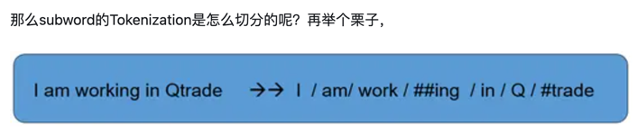
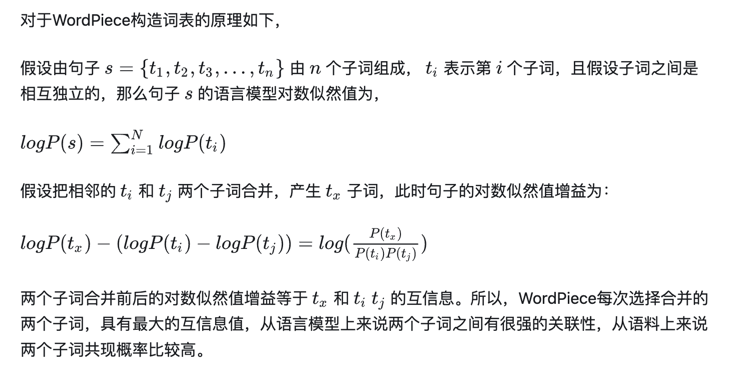
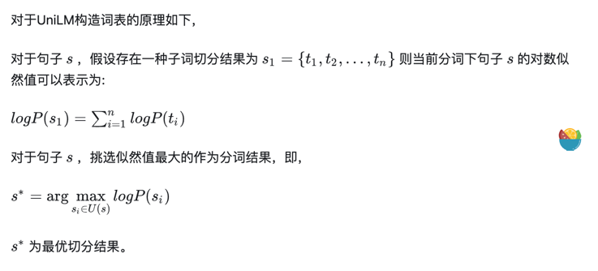
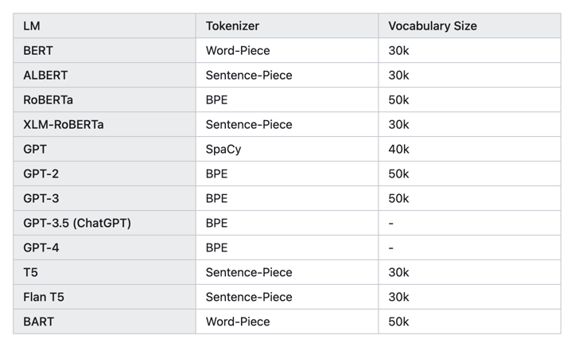
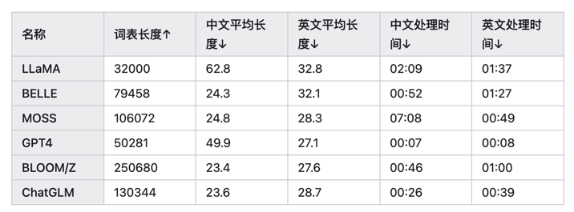
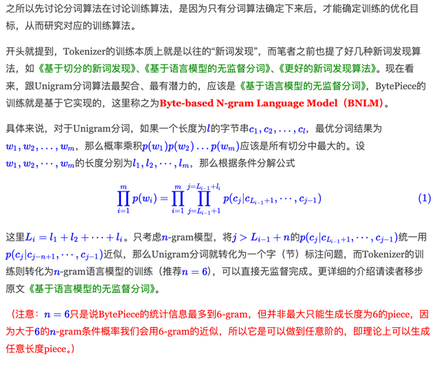

# Tokenization

Tokenization的难点是：
- 如何获得理想的切分，使文本中所有的token都具有正确的语义，并且不会存在遗漏(OOV问题)

按切分粒度可分为三大类：
- 词粒度
- 字粒度
- 子词粒度
  - BPE
  - SentencePiece
  - UniLM
  - WordPiece

词粒度

基于词表和分词规则可以分为三类：

- 前（后）向最大匹配法
- 最短路径分词法
- 基于 n-gram LM 的统计词频分词法

给定一个词典V，如何对句子S进行分词呢？

例如：

S：他说的确实在理

V：他 的 瞒 确 实 在 理 由 不 相 其 理由 确实 实在 的确 在理

- 前（后）向最大匹配法
  - 前（后）向最大匹配法的方法很简单，只需要知道前向匹配，那么后向匹配自然也就理解了。这里以前向最大匹配法进行讲解。我们来看一个例子，就能对前向匹配法的了然。
  - 预设条件：  
    - 1. 设定最大匹配长度2（当然可以是3，4，5或者更长）； 
    - 2. 从左往右扫描句子（也可以从右往左）。
```python
def forward_maximum_matching(sentence, dictionary):
    max_word_length = max(len(word) for word in dictionary)
    result = []
    index = 0
    while index < len(sentence):
        match_found = False
        for size in range(max_word_length, 0, -1):
            if index + size > len(sentence):
                continue
            word = sentence[index:index + size]
            if word in dictionary:
                result.append(word)
                index += size
                match_found = True
                break
        if not match_found:
            # If no match found, consider single character as a word
            result.append(sentence[index])
            index += 1
    return result

# Given sentence and dictionary
sentence = "他说的确实在理"
dictionary = {"他", "的", "瞒", "确", "实", "在", "理", "由", "不", "相", "其", "理由", "确实", "实在", "的确", "在理"}

# Perform forward maximum matching
segmented_sentence = forward_maximum_matching(sentence, dictionary)
print(segmented_sentence)
# ['他', '说', '的', '确实', '在理']
```

- 最短路径分词法

最短路径分词是一种基于图论的分词方法，通过将句子中的每个字看作图中的节点，如果两个字之间可以组成词典中的一个词，就在这两个字之间连一条边，边的权重为词的长度或其他定义的成本。然后，通过寻找从句子开头到结尾的最短路径来实现分词。

```python
import networkx as nx

def shortest_path_segmentation(sentence, dictionary):
    # 创建有向图
    G = nx.DiGraph()
    
    # 添加节点
    for i in range(len(sentence) + 1):
        G.add_node(i)
    
    # 添加边
    for i in range(len(sentence)):
        for j in range(i + 1, len(sentence) + 1):
            word = sentence[i:j]
            if word in dictionary:
                G.add_edge(i, j, weight=len(word)) # 边的权重为词的长度
    
    # 使用Dijkstra算法寻找最短路径
    path = nx.shortest_path(G, source=0, target=len(sentence), weight='weight')
    
    # 根据最短路径进行分词
    result = []
    for k in range(len(path) - 1):
        result.append(sentence[path[k]:path[k + 1]])
    
    return result

# 给定句子和词典
sentence = "他说的确实在理"
dictionary = {"他", "的", "瞒", "确", "实", "在", "理", "由", "不", "相", "其", "理由", "确实", "实在", "的确", "在理"}

# 进行最短路径分词
segmented_sentence = shortest_path_segmentation(sentence, dictionary)
print(segmented_sentence)
# ['他', '说', '的', '确实', '在理']

```

- 基于N-Gram语言模型的统计词频分词法

基于N-Gram语言模型的统计词频分词法是一种基于统计概率的分词方法，通过利用N-Gram模型来计算词序列的概率，从而确定最优的分词方式。在这里，假设N是2，即使用二元语法模型（Bigram）来进行分词。

## 子词粒度的 Tokenization

怎么样的Tokenization才是理想的Tokenization？

概括来说就是，词表要尽可能地小，小的同时又能覆盖到绝大多数的词尽可能地少出现OOV的词，

另外此表中的每一个token都是由意义的，也就是说，对于一个词切出来的subwords中每一个都是由意义的，而且不要且得太细。



如何构造出 subwords 词典呢？常见的四种方式：

参考链接：https://zhuanlan.zhihu.com/p/631463712

  - BPE
  - SentencePiece
  - UniLM
  - WordPiece

### BPE

从GPT-2开始一直到GPT-4，OpenAI一直采用BPE分词法。

BPE（Byte Pair Encoding）是一种用于文本数据压缩和处理的技术，尤其常用于自然语言处理（NLP）中的词汇表构建和子词级别的分词。

BPE 的基本思想是通过迭代地合并频率最高的相邻符号对，逐步构建出更长的子词单元。具体步骤如下：

1. 初始化：将每个输入文本拆分为最小的符号单元（通常是字符）。
2. 统计频率：统计所有相邻符号对的出现频率。
3. 合并符号对：找到频率最高的符号对，将其合并成一个新的符号。
4. 更新文本：用新的合并符号替换文本中的原符号对。
5. 重复步骤 2-4：继续合并直到达到预定的词汇表大小或不再有符号对可以合并。

例如：

已知字符串aaabdaaabac ->

a a a b d a a a b a c ->

('a', 'a'): 4
('a', 'b'): 2
('b', 'd'): 1
('d', 'a'): 1
('b', 'a'): 2
('a', 'c'): 1 合并 a 和 a ->

aa a b d aa a b a c

重复上面的过程

如何将句子切分成子词？

```markdown
# 给定单词序列
["the</w>", "highest</w>", "mountain</w>"]

# 从一个很大的corpus中排好序的subword表如下
# 长度 6         5           4        4         4       4          2
["errrr</w>", "tain</w>", "moun", "est</w>", "high", "the</w>", "a</w>"]

# 迭代结果
"the</w>" -> ["the</w>"]
"highest</w>" -> ["high", "est</w>"]
"mountain</w>" -> ["moun", "tain</w>"]
```

注意，在上述算法执行后，如果句子中仍然有子字符串没被替换但所有subword都已迭代完毕，则将剩余的子词替换为特殊token，如 `<unk>` 。

从这里大家也可以发现了，原则上`<unk>` 这个token出现的越少越好，所以我们也往往用`<unk>` 的数量来评价一个tokenizer的好坏程度，这个token出现的越少，tokenizer的效果往往越好。


### WordPiece

Bert 一族基本上使用的是这种方法。

与BPE相同点： 每次从统计语料中选取出两个新的子词进行合并。

它与BPE最大区别在于选择两个子词进行合并的原则：BPE按频率，WordPiece按能够使得LM概率最大的相邻子词加入词表。




有关BERT的tokenizer还有一个重点：BERT在使用Word-Piece时加入了一些特殊的token，例如[CLS]和[SEP]。我们可以自己试一下：

```python
from transformers import BertTokenizer
inputs='Coolest pretrained Asmita!'
tokenizer = BertTokenizer.from_pretrained('bert-base-uncased')
input_ids = tokenizer.encode(inputs, return_tensors='pt')
print(input_ids)
for input_id in input_ids [0]:
    print(tokenizer.decode(input_id))

```
输出：

```markdown
tensor([[  101,  4658,  4355,  3653, 23654,  2098,  2004, 22930,  2050,   999,
           102]])
[ C L S ]
c o o l
# # e s t
p r e
# # t r a i n
# # e d
a s
# # m i t
# # a
!
[ S E P ]
```
发现BERT在句首加上了[CLS]，句尾加上了[SEP]，而且对coolest做了子词分解，对词根est加上了##来表示这是一个后缀。对于没有出现在词汇表里的单词例如asmita（是个印度人名），BERT所用的Word-Piece tokenizer会将它分解为Word-Piece算法形成的子词词汇表中存在的as，mit和a，组成一个子词。


### UniLM

这种方法与WordPiece相同点是：同样使用语言模型来挑选子词。

与WordPiece最大区别：WordPiece算法的词表大小都是从小到大变化。UniLM的词库则是从大到小变化,即先初始化一个大词表，根据评估准则不断丢弃词表，直到满足限定条件。

ULM算法考虑了句子的不同分词可能，因而能够输出带概率的多个子词分段。




### SentencePiece

以上三中方法都存在着两个问题就是1.无法逆转；2.训练的时候需要提前切分。无法逆转是什么意思呢，就是对句子s进行切分后得到的结果无法准确复原回s。更直白地说就是空格不能被保留，如下，

```markdown
Tokenize("Hello World !") == Tokenize("Hello World!")
```

SentencePiece主要是为了多语言模型设计的，它做了两个重要的转化：

- 以unicode方式编码字符，将所有的输入（英文、中文等不同语言）都转化为unicode字符，解决了多语言编码方式不同的问题。
- 将空格编码为‘_’， 如'New York' 会转化为['_', 'New', '_York']，这也是为了能够处理多语言问题，比如英文解码时有空格，而中文没有， 这种语言区别。

想要加上某些本来tokenizer中不存在的token，可以使用add_tokens()方法。
这之后，还需要告诉模型我已经更新了词汇表，使用`model.resize_token_embeddings(len(tokenizer))`

而SentencePiece的解决方法是：

1. SentencePiece首先将所有输入转换为unicode字符。这意味着它不必担心不同的语言、字符或符号，可以以相同的方式处理所有输入；
2. 空白也被当作普通符号来处理。Sentencepiece显式地将空白作为基本标记来处理，用一个元符号 “▁”（ U+2581 ）转义空白，这样就可以实现简单地decoding；
3. Sentencepiece可以直接从raw text进行训练；
4. 支持BPE和UniLM训练方法。





## 怎么训练一个更纯粹、更高压缩率的 Tokenizer ？

参考文献：苏神的BytePiece https://kexue.fm/archives/9752

### 理想特性

Tokenizer至少应该具备如下基本特性：

1、无损重构：分词结果应该可以无损还原为输入；

2、高压缩率：词表大小相同时，同一批数据的tokens数应该尽可能少；

3、语言无关：基于统计，训练和分词过程都不应引入语言特性；

4、数据驱动：可以直接基于原始语料进行无监督训练；

5、训练友好：能够在合理的时间和配置上完成训练过程。

### 模型构思

一个新Tokenizer的构建，可以分解为三个部分：

1、基本单元；
2、分词算法；
3、训练算法。

确定这三个部分后，剩下的就只是编程技巧问题了。

### 基本单元

我们知道，Python3的默认字符串类型是Unicode，如果以Unicode为基本单位，我们称之为Char-based。Char-based很直观方便，汉字表现为长度为1的单个字符，但不同语言的Char实在太多，即便只是覆盖单字都需要消耗非常大的vocab_size，更不用说引入Word。

后面的流程还是考虑以Byte为基本单位。

回到Byte之后，很多问题都“豁然开朗”了。因为不同的单Byte只有256个，所以只要词表里包含了这256个单Byte，那么就可以杜绝OOV（Out of Vocabulary），这是它显而易见的好处。

此外，我们知道汉字的平均信息熵要比英文字母的平均信息熵要大，如果我们选择Char-based，那么虽然每个Char表面看起来长度都是1，但“内在”的颗粒度不一样，这会导致统计结果有所偏置。

相比之下，每个Byte的信息熵则更加均匀【比如，大部分汉字的UTF-8编码对应3个Byte，而汉字的平均信息熵正好是英文字母（对应一个Byte）的2～3倍左右】，因此用Byte的统计结果会更加无偏，这将会使得模型更加“语言无关”。


### 分词算法

基于词典进行分词的算法无非就那几种，比如最大匹配、最短路径、最大概率路径等

跟jieba等中文分词工具一样，BytePiece选择的是最大概率路径分词，也称“一元文法模型”，即Unigram。

选择Unigram有三方面的考虑：

第一，Unigram的最大概率换言之就是最大似然，而LLM的训练目标也是最大似然，两者更加一致；

第二，从压缩的角度看，最大概率实际上就是最短编码长度（也叫最小描述长度），是压缩率最大化的体现，这也跟“压缩就是智能”的信仰一致；

第三，Unigram求最优分词方案可以通过Viterbi算法在线性复杂度内完成，这是理论最优的复杂度了。

当然，既然有“一元文法模型”，自然也有更复杂的“二元文法模型”、“三元文法模型”等，但它们的复杂度增加远大于它能带来的收益，所以我们通常不考虑这些高阶模型。


### 训练算法

之所以先讨论分词算法在讨论训练算法，是因为只有分词算法确定下来后，才能确定训练的优化目标，从而研究对应的训练算法


